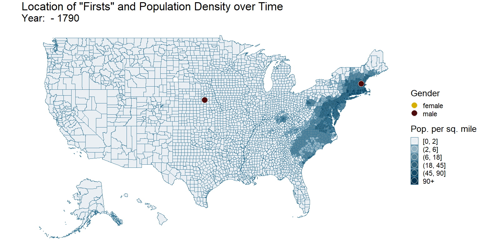

```{r setup, include = FALSE}

knitr::opts_chunk$set(
  echo = TRUE,
  message = FALSE, # no messages
  warning = FALSE, # no warnings
  # tidy=FALSE,    # display code as typed
  size="small")    # slightly smaller font for code

# default visualisation params
knitr::opts_chunk$set(
  # fig.width=6.75, 
  # fig.height=6.75,
  fig.align = "center"
)

```


```{r libraries, include = FALSE}

# load necessary libraries

library(tidyverse)
library(vroom)
library(janitor)
library(sf)
library(here)
library(extrafont)
library(ggtext)
library(lubridate)
library(urbnmapr)
library(readxl)
library(stringr)
library(ggnewscale)
library(gganimate)
library(animation)
library(transformr)
library(tidyquant)
library(rvest)
library(parsedate)
library(opencage)
library(gender)

loadfonts(device="win")

```


[source](https://www.projectlooksharp.org/blog/wp-content/uploads/2020/02/black-lives-matter-1024x575.png)

# Celebrating Black Lives

In years gone by, **Black History Month** has been the only time of year when people talk about the achievements of Black People and recognise their contributions.

We want to change this by analysing **African-American Firsts**, that have historically marked footholds. These breakings of the colour barrier across a wide range of topics have often led to widespread cultural change. 

In the following work, we will

- scrape data from [Wikipedia](https://en.wikipedia.org/wiki/List_of_African-American_firsts), where a list of **African-American Firsts** can be found
- enrich this data by scraping additional information from other [Wikipedia](https://en.wikipedia.org/wiki/Main_Page) sites
- clean the data and add [population information](https://conservancy.umn.edu/handle/11299/181605)
- look at the number of **African-American Firsts** over time and draw connections to American history
- analyse where the achievers were born (geospatial analysis)
- take a critical look at the gender gap 
- see how old the achievers were when breaking the colour barrier

Fasten your seatbelt and let the wild ride begin!

  
[source](https://giphy.com/gifs/originals-dawnie-jefferson-thats-wild-that-is-UufAH7FSltoa7NzIKF)


# The Data

As indicated above, the process of data extraction, enrichment, and cleaning is quite complex and time-consuming.
We will execute the following steps:

- We will first scrape the list of **African-American Firsts**, that can be found on [Wikipedia](https://en.wikipedia.org/wiki/List_of_African-American_firsts).
- After that, we will scrape the individual [Wikipedia](https://en.wikipedia.org/wiki/Main_Page) webpage of each individual achiever to get their birthdays and birth locations. 
- Third, we will use the scraped location information to get geospatial information via forward geocoding.
- Fourth, we infer the gender of each achiever and the category of the achievement. 
- Finally, we clean up loose ends, load shapefiles for America and enrich this geospatial data by adding [population information](https://conservancy.umn.edu/handle/11299/181605).

## Scraping List of African-American Firsts

In this part, we scrape the complete [Wikipedia page](https://en.wikipedia.org/wiki/List_of_African-American_firsts) containing the list of **African-American Firsts**. For this, we leverage the `rvest` library. Even though this part is inspired by [tidytuesday](https://github.com/rfordatascience/tidytuesday/tree/master/data/2020/2020-06-09), we have completely revised the code, such that only little resemblance is left. 


```{r scraping wikipedia list, eval = FALSE}

# define URL of the list of African-American Firsts
first_url <- "https://en.wikipedia.org/wiki/List_of_African-American_firsts"


# load complete wikipedia page into R
raw_first <- read_html(first_url)


# function to extract the year of a "first" from the raw HTML code
get_year <- function(id_num){
  
  # parse raw HTML code to extract the year of the "first"
  raw_first %>% 
    html_nodes(glue::glue("#mw-content-text > div > h4:nth-child({id_num}) > span.mw-headline")) %>% 
    html_attr("id")
  
}


# function to extract the complete line / entry of each "first" from the raw HTML code
get_first <- function(id_num){
  
  # parse raw HTML code to extract the line / entry of the "first"
  raw_first %>% 
    html_nodes(glue::glue("#mw-content-text > div > ul:nth-child({id_num}) > li")) %>% 
    # store multiple "first" per year in a list
    lapply(function(x) x)
  
}


# find years and complete lines / entries of the "firsts" in the scraped webpage
raw_first_df <- tibble(id_num = 1:409) %>% 
  mutate(
         # year contains the year of the "firsts"
         year = map(id_num, get_year),
         # data contains the raw lines / entries of the "firsts" 
         # we have one list of lines / entries per each year
         data = map(id_num, get_first)) %>% 
  
  # convert year to integer
  mutate(year = as.integer(year)) %>% 
  
  # fill empty year cells with the last existing value for year
  fill(year) %>% 
  
  # give each raw line / entry of a "first" its own row, i.e.
  # unnest the list of entries into separate rows
  unnest(data)


# function to extract the link to the wikipedia page of the person, that has achieved the "first"
extract_website <- function(x) {
  
  # parse raw line / entry of the "first" to extract the wikipedia link
  x %>% 
    str_replace(":.*?<a", ": <a") %>% 
    str_extract(": <a href=\\\".*?\\\"") %>% 
    str_extract("/wiki.*?\\\"") %>% 
    str_replace("\\\"", "")
  
}


# function to extract the concrete description of the "first"
extract_first <- function(x) {
  
  # parse raw line / entry of the "first" to extract the description of the "first"
  x %>% 
    str_extract("^First.*?:") %>% 
    str_replace(":", "")
  
}


# function to extract the name of the person, that has achieved the "first"
extract_name <- function(x) {
  
  # parse raw line / entry of the "first" to extract the name of the achiever
  x %>% 
    str_replace(":.*?<a", ": <a") %>% 
    str_extract(": <a href=\\\".*?\\\">") %>% 
    str_extract("title=.*\\\">") %>% 
    str_replace("title=\\\"", "") %>% 
    str_replace("\\\">", "")
  
}


# extract wikipedia links, names and description of "firsts"
clean_first <- raw_first_df %>%
  mutate(
         # get raw html string (with tags) for the complete lines of the "firsts" 
         data_string_raw = map_chr(data, toString),
         # get only html text (without tags) for the complete lines of the "firsts
         data_string_cle = map_chr(data, html_text)) %>% 
  
  mutate(
         # get the link to the wikipedia page of the person, that has achieved the "first"
         wiki = map_chr(data_string_raw, extract_website),
         # get the concrete description of the "first"
         first = map_chr(data_string_cle, extract_first),
         # get the name of the person, that has achieved the "first"
         name = map_chr(data_string_raw, extract_name)) %>% 
  # drop rows where some information is missing
  drop_na()


# clean up
rm(extract_first, extract_name, extract_website, 
   get_first, get_year, 
   raw_first, raw_first_df, first_url)

```


WOW! That was quite some parsing and wrangling with the HTML. However, this was only the beginning!  
We do not yet have too much information.. We basically only know the year of the achievement, the name of the achiever, what the person did and a link to the wikipedia page of that person. What we would be really interested in is where the achiever was born (in order to perform geospatial analyses) and when the achiever was born (in order to analyse how old the person was when achieving the "first"). 

Well, let's move on and collect this information in the next section!


## Scraping Individual Wikipedia Pages of the Achievers

In this section, we will scrape the individual [Wikipedia](https://en.wikipedia.org/wiki/Main_Page) webpages of each individual achiever. Thanks to our good work in the last section, we know the link to the [Wikipedia](https://en.wikipedia.org/wiki/Main_Page) page of each individual achiever!

We scrape the [Wikipedia](https://en.wikipedia.org/wiki/Main_Page) page of each individual achiever in order to find out their birth date and their location of birth. 


```{r scraping individual pages, eval = FALSE}

# function to get the location and birthday of a person given a 
# link to the wikipedia page of that person
extract_bday_location <- function(wiki){
  
  # read complete wikipedia page of a person
  html <- read_html(paste0("https://en.wikipedia.org", wiki))
  
  
  # extract birth date by parsing the raw HTML
  
  # if we are lucky, wikipedia tells us exactly where
  # to find the birthday
  bd <- html %>% 
    html_node(glue::glue('span[class="bday"]')) %>% 
    html_text()
  
  # if not, we have to do some advanced HTML parsing to 
  # find the birthday
  if(is.na(bd)){
    
    bd <- html %>% 
      html_node("table.vcard") %>% 
      toString() %>% 
      str_replace_all("\\n", "") %>% 
      str_extract("Born.*?</td>") %>% 
      str_extract("<td>.*?<") %>% 
      str_replace("<td>", "") %>% 
      str_replace("<", "") %>% 
      str_replace("\\(.*", "") %>% 
      str_trim() %>% 
      str_replace_all("[^[:alnum:] ]", "") %>% 
      # convert parsed birthday string to a date
      parse_date(approx = TRUE)
    
  }
  
  # finally we convert the bday to a string
  if(!is.na(bd)){
    bd <- toString(bd)
  }
  
  
  # extract birth location by parsing the raw HTML
  
  # parse raw HTML to find birth location
  lo <- html %>% 
    html_node("table.vcard") %>% 
    toString() %>% 
    str_replace_all("\\n", "") %>% 
    str_extract("Born.*?</td>") %>% 
    str_replace("Born</th>", "")
  
  # handling of edge cases
  if(length(str_locate_all(lo, "<br>")[[1]]) == 4){
    lo <- str_replace(lo, "<br>", "")
  }
  
  lo <- lo %>% str_extract("<br><.*?</td>$")
  
  if(!is.na(lo)){
    lo <- lo %>% 
      read_html() %>% 
      html_text()
  }
  
  
  # return bday and location of birth as a list
  return(list(bd, lo))
  
}


# extract birthday and location and store them in new columns
clean_first_augmented <- suppressMessages(clean_first %>% 
                                         # extract birthday and location from wikipedia
                                         mutate(combi = map(wiki, extract_bday_location)) %>% 
                                         # unnest birthday and location into separate columns
                                         unnest_wider(combi) %>% 
                                         # rename new columns
                                         rename(bday = `...1`, location = `...2`) %>% 
                                         # convert bday to character (from list type)
                                         mutate(bday = map_chr(bday, function(x) x))) %>% 
  
  # it is possible that there was a mistake with the extraction of the birthday 
  # --> delete the wrong birthday in such cases
  mutate(bday = ifelse(year(bday) == 2020, NA_character_, bday))


# clean up
rm(clean_first, extract_bday_location)


```

Nice! We have successfully enriched our dataset with birthdays and locations. However, the locations alone are not really helpful. To do some geospatial analyses, we need the geocodes. Let's move on!

## Forward Geocoding of Locations

To be able to visualise our findings using maps, we need the geolocations. Hence, we use the opencage package to get lng/lat
of the location of birth for each individual achiever:

```{r geocoding, eval = FALSE}

# wrapper function of `opencage_forward` to handle missing locations
opencage_custom <- function(x) {
  
  # if there is no location, return NA
  if(is.na(x)){
    return(NA_character_)
  }
  
  # otherwise find geolocation with opencage
  else{
    return(opencage_forward(x, limit = 1))
  }
  
}


# find geolocation for each individual achiever
clean_first_augmented <- suppressMessages(clean_first_augmented %>% 
                                            
                                         # get information from opencage
                                         mutate(location_geo = map(location, opencage_custom)) %>% 
                                         
                                         # parse and clean the information from opencage
                                         unnest_wider(location_geo) %>% 
                                         unnest(results, keep_empty = TRUE) %>% 
                                         rename(lat = geometry.lat,
                                                lng = geometry.lng,
                                                country = components.country,
                                                state = components.state,
                                                county = components.county,
                                                city = components.city,
                                                FIPS_state = annotations.FIPS.state) %>% 
                                         select(id_num, year, data_string_raw, data_string_cle, 
                                                wiki, first, name, bday, 
                                                location, lat, lng, country, state, county, city, FIPS_state))


# clean up
rm(opencage_custom)

```


That went smoothly! We are now able to use lng/lat to produce beautiful maps! However, we are still not 100% happy with our data.
It would be really great to also have information about the field of the achievement and the gender of the achiever. We will infer both variables in the next section.

## Infer Gender and Category

For our analysis, we want to know which kind of "first" was achieved, i.e. we want to map each "first" into a category.   
Additionally, we want to know which sex the achievers have.

We will start by getting a `category` variable. To map each "first" into a category, we define words that are indicators for specific categories. If we find such a word in the description of a "first", we categorize this "first" accordingly:

```{r find category, eval = FALSE}

# define indicator words for each category

edu <- c(
  "practice", "graduate", "learning", "college", "university", "medicine",
  "earn", "ph.d.", "professor", "teacher", "school", "nobel", "invent", "patent",
  "medicine", "degree", "doctor", "medical", "nurse", "physician", "m.d.", "b.a.", "b.s.", "m.b.a",
  "principal", "space", "astronaut", "scientific") %>% 
  paste0(collapse = "|")

religion <- c("bishop", "rabbi", "minister", "church", "priest", "pastor", "missionary",
              "denomination", "jesus", "jesuits", "diocese", "buddhis", "cardinal") %>%
  paste0(collapse = "|")

politics <- c(
  "diplomat", "elected", "nominee", "supreme court", "legislature", "mayor", "governor",
  "vice President", "president", "representatives", "political", "department", "peace prize",
  "ambassador", "government", "white house", "postal", "federal", "union", "trade",
  "delegate", "alder", "solicitor", "senator", "intelligience", "combat", "commissioner",
  "state", "first lady", "cabinet", "advisor", "guard", "coast", "secretary", "senate",
  "house", "agency", "staff", "national committee", "lie in honor") %>%
  paste0(collapse = "|")

sports <- c(
  "baseball", "football", "basketball", "hockey", "golf", "tennis",
  "championship", "boxing", "games", "medal", "game", "sport", "olympic", "nascar",
  "coach", "trophy", "nba", "nhl", "nfl", "mlb", "stanley cup", "jockey", "pga",
  "race", "driver", "ufc", "champion", "highest finishing position") %>%
  paste0(collapse = "|")

military <- c(
  "serve", "military", "enlist", "officer", "army", "marine", "naval",
  "officer", "captain", "command", "admiral", "prison", "navy", "general",
  "force") %>%
  paste0(collapse = "|")

law <- c("american bar", "lawyer", "police", "judge", "attorney", "law", 
         "agent", "fbi") %>%
  paste0(collapse = "|")

arts <- c(
  "opera", "sing", "perform", "music", "billboard", "oscar", "television",
  "movie", "network", "tony award", "paint", "author", "book", "academy award", "curator",
  "director", "publish", "novel", "grammy", "emmy", "smithsonian",
  "conduct", "picture", "pulitzer", "channel", "villain", "cartoon", "tv", "golden globe",
  "comic", "magazine", "superhero", "pulitzer", "dancer", "opry", "rock and roll", "radio",
  "record") %>%
  paste0(collapse = "|")

social <- c("community", "freemasons", "vote", "voting", "rights", "signature", 
            "royal", "ceo", "community", "movement", "invited", "greek", "million",
            "billion", "attendant", "chess", "pilot", "playboy", "own", "daughter",
            "coin", "dollar", "stamp", "niagara", "pharmacist",
            "stock", "north pole", "reporter", "sail around the world", "sail solo around the world", "press", "miss ",
            "everest")  %>%
  paste0(collapse = "|")


# categorize "firsts" by looking for indicator words in the description
first_df <- clean_first_augmented %>% 
  mutate(category = case_when(
    str_detect(tolower(first), military) ~ "Military",
    str_detect(tolower(first), law) ~ "Law",
    str_detect(tolower(first), arts) ~ "Arts & Entertainment",
    str_detect(tolower(first), social) ~ "Social & Jobs",
    str_detect(tolower(first), religion) ~ "Religion",
    str_detect(tolower(first), edu) ~ "Education & Science",
    str_detect(tolower(first), politics) ~ "Politics",
    str_detect(tolower(first), sports) ~ "Sports",
    TRUE ~ NA_character_
  )) %>% 
  rename(accomplishment = first)


# clean up
rm(arts, edu, law, first_url, military, politics, religion, social, sports,
   clean_first_augmented)

```


Next, we try to infer the sex of a person, that has achieved a "first". To do this, we both look at the description of the first and look for indicators like "she", "women" or "man" and use the `gender` package to infer sex:

```{r infer gender, eval = FALSE}

# add gender

# see if we find words in the description of the "first", that identify gender
first_df <- first_df %>% 
  mutate(gender = if_else(str_detect(data_string_cle, 
                                     "\\swoman\\s|\\sWoman\\s|\\sher\\s|\\sshe\\s|\\sfemale\\s"), 
                          "female", 
                  if_else(str_detect(data_string_cle, 
                                     "\\sman\\s|\\sMan\\s|\\shim\\s|\\she\\s|\\smale\\s"), 
                          "male", 
                          "idk")))


# use gender package as second source of info (parse first name)
# input: full name and the year of the "first"
get_gender <- function(name, year){
  
  # get first name
  name <- strsplit(name, split = " ")[[1]][1]
  
  # define right method (see ?gender)
  method = ifelse(year < 1930, "ipums", "ssa")
  
  # get the gender
  ret <- gender(name, method = method, countries = "United States") %>% 
    select(gender) %>% 
    pull()
  
  if(typeof(ret) == "logical"){
    return(NA_character_)
  }
  else{
    return(ret)
  }
  
}


# build final "gender" column
first_df <- first_df %>% 
  # use first name and year to infer gender
  mutate(gender_2 = map2(name, year, get_gender)) %>% 
  # convert to character
  mutate(gender_2 = map_chr(gender_2, function(x) x)) %>%
  # combine both gender columns into one final column
  mutate(gender = if_else(gender != "idk", gender, gender_2)) %>% 
  select(-gender_2)


# clean up
rm(get_gender)

```


Great! We can finally say:

  
[source](https://giphy.com/gifs/l4RKhOL0xiBdbgglFi)

Let us save this part of our work as a csv:

```{r save data, eval = FALSE}

write_csv(first_df, path = here("../data/firsts_augmented.csv"))

```


In the next section, we can now calculate variables like `age` and load shapefiles for the mapping.

## Data Transformation and Shapefile Loading

### Load and Transform "Firsts"

Let us load our scraped and curated data and have a look at it:

```{r load glimpse}

# load "firsts" data and clean column names
firsts <- read_csv(here("../data/firsts_augmented.csv"), 
                   col_types = cols(year = col_integer(), 
                                    id_num = col_integer())) %>% 
  clean_names()

# glimpse at data
glimpse(firsts)

```

As we took care of cleaning the data while scraping, there is no much work left to do. We can see that we have quite some NAs. This is because we were not always able to scrape a `bday` or geocode a `location`. However, this shouldn't be a big issue for our analysis and unfortunately there is nothing we can do about it. 

We do not need the columns `id_num`, `data_string_raw`, `data_string_cle`, and `wiki` anymore. Hence, we can drop them:

```{r drop columns}

firsts <- firsts %>% 
  select(-data_string_raw, 
         -data_string_cle,
         -wiki, 
         -id_num)

```


For our analysis, we need a binned `year` variable and a variable `age`, that measures how old a person was when achieving the "first". We create them in the following:

```{r transform firsts}

# cut year into buckets 
# needed for gganimate and the timeline
firsts <- firsts %>% 
  mutate(year_bins = cut(year, 
                        breaks = c(min(year)-1, c(seq(1790, 2020, 10))), 
                        labels = c(seq(1790, 2020, 10)))) %>% 
  mutate(year_bins = as.integer(levels(year_bins))[year_bins]) %>% 
  mutate(year_bins_2 = cut(year, 
                        breaks = c(min(year)-1, c(seq(1760, 2020, 5))), 
                        labels = c(seq(1760, 2020, 5)))) %>% 
  mutate(year_bins_2 = as.integer(levels(year_bins_2))[year_bins_2])


# calculate age when person achieved the "first"
# also cut age into buckets
firsts <- firsts %>% 
  mutate(age = year - year(bday)) %>% 
  mutate(age_bins = cut(age, 
                        breaks = c(seq(0, 100, 10)), 
                        labels = c(seq(0, 90, 10)),
                        right  = FALSE)) %>% 
  mutate(age_bins = as.integer(levels(age_bins))[age_bins])


```

Great, that should be it! We conclude this section by describing the resulting tibble:

#### Data Dictionary

|variable |class     |description |
|:--------|:---------|:-----------|
|year     |integer   | Year of the achievement |
|accomplishment     |character | Description of the actual achievement or attainment |
|name   |character | The person who accomplished the specific accomplishment |
|category   |character | A few meta-categories of different accomplishments |
|bday |date | Birthday of the achiever |
|gender |character | Gender of the achiever |
|location |character | Location of birth of the achiever |
|lat |double | Location of birth of the achiever: Longitude |
|lng |double | Location of birth of the achiever: Latitude |
|country |character | Location of birth of the achiever: Country |
|state |character | Location of birth of the achiever: State |
|county |character | Location of birth of the achiever: County |
|city |character | Location of birth of the achiever: City |
|fips_state |character | Location of birth of the achiever: FIPS of State |
|year_bins |integer | Binned year of the achievement |
|age |double | Age of person when the "first" was achieved |
|age_bins |integer | Binned age |


### Load and Transform Shapefiles

To be able to plot our data on a map, we need the shapefiles of the US and we have to convert the firsts to a compatible format. For this, we leverage the `sf` package and the `urbnmapr` package:

```{r shapefiles}

# load states shapefile
states_sf <- get_urbn_map("states", sf = TRUE)

# transfrom geometry to 4326, or pairs of latitude/longitude numbers
states_sf <-  states_sf %>% 
  st_transform(4326) # transfrom to WGS84, latitude/longitude


# load counties shapefile
counties_sf <- get_urbn_map("counties", sf = TRUE)

# transfrom geometry to 4326, or pairs of latitude/longitude numbers
counties_sf <-  counties_sf %>% 
  st_transform(4326) # transfrom to WGS84, latitude/longitude


# convert firsts to a sf object with jitter on coordinates
set.seed(100)
firsts_jitter_sf <- firsts %>% 
  
  # drop rows with missing values
  drop_na(lng, lat, gender) %>%
  
  # jitter points such that they are better visible
  mutate(lng = jitter(lng, amount = 1),
         lat = jitter(lat, amount = 1)) %>% 
  
  # filter for valid locations in the US
  filter(country == "United States of America") %>% 
  filter(lng > -140) %>% 
  
  # convert to sf object
  st_as_sf(coords = c('lng', 'lat'), 
           crs = st_crs(states_sf))


```

Note that we have jittered the coordinates of the birth locations, as there are for example a lot of locations pointing to New York City. Using jitter makes the maps we will produce much more insightful, as points are not overlapping that much anymore.  

What is also important for our analysis are actual population numbers. Because at first sight, the geospatial distribution of firsts might seem odd. However, taking actual population data into account might give a much clearer picture. Hence, we load [population data](https://conservancy.umn.edu/handle/11299/181605) from 1790-2010:


```{r population}

# load absolute population data from 1790-2010 and clean names
# source: https://conservancy.umn.edu/handle/11299/181605
population_abs <- read_xlsx(here("../data/county2010_hist_pops.xlsx"), sheet = "c2010_hist_pops") %>% 
  clean_names()

# bring data into long format and clean the year
population_abs <- population_abs %>% 
  
  # bring to long format
  pivot_longer(cols = epop1790:pop2010, names_to = "year", values_to = "pop") %>% 
  
  # extract / clean year
  mutate(year = str_sub(year, -4, -1)) %>% 
  
  # only take relevant columns
  select(geoid10, year, pop)


# load population density data from 1790-2010 and clean names
# source: https://conservancy.umn.edu/handle/11299/181605
population_dens <- read_xlsx(here("../data/county2010_hist_pops.xlsx"), sheet = "densities") %>% 
  clean_names()

# bring data into long format and clean the year
population_dens <- population_dens %>% 
  
  # bring to long format
  pivot_longer(cols = dens1790:dens2010, names_to = "year", values_to = "dens") %>% 
  
  # extract / clean year
  mutate(year = str_sub(year, -4, -1))


# join population densities and absolute numbers in one table
population <- population_dens %>% 
  left_join(population_abs) %>% 
  
  # cut density into buckets (otherwise we have some with values of over 2000, 
  # and others with values < 2 --> not good for visualisation / colouring)
  mutate(dens_2 = cut(dens, 
                      breaks = c(-0.1, 2, 6, 18, 45, 90, max(dens)),
                      labels = c("[0, 2]", 
                                 "(2, 6]", 
                                 "(6, 18]", 
                                 "(18, 45]", 
                                 "(45, 90]", 
                                 "90+"),
                      ordered_result = TRUE)) %>% 
  
  # convert year to integer
  mutate(year = as.integer(year))


# we only have population data until 2010. However, we also have "firsts" in the period of 2010-2020.
# to be able to animate this properly with gganimate, we will duplicate the 2010 values and set them
# as values for 2020. We will end up with population data for 1790 until 2020.
# To say it clear: we assume that there are no changes in population from 2010 to 2020.

pop_2020 <- population %>% 
  filter(year == 2010) %>% 
  mutate(year = 2020)

population <- bind_rows(population, pop_2020) %>% 
  arrange(geoid10, year)


# join counties_sf and population data
counties_pop_sf <- counties_sf %>% 
  left_join(population, by = c("county_fips" = "geoid10"))


# clean up
rm(population, population_abs, population_dens, pop_2020)

```


We end up having a ready-to-plot shapefile of "firsts", a shapefile to plot US states and a shapefile to plot US counties.
Additionally, we have a big shapefile `counties_pop_sf`, that holds information about the population in each US county
since 1790!

Unbelievable, this was the last part of the data scraping and wrangling part! We are ready to go on now to visualise the data and tell our story!

Let's say goodbye to this technically demanding part of our work:

  
[source](https://giphy.com/gifs/venommovie-sony-venom-movie-Dr1i3afFIL68D9adzp)


# The Story

## "Firsts" over Time and American History

```{r history}

firsts %>% 
  count(year_bins_2) %>% 
  ggplot(aes(x = year_bins_2, y = n)) +
  geom_line(size = 1, color = "#04314D") + 
  geom_vline(xintercept = 1861, # civil war
             color = "#D6AF00", size=1) +
  theme_minimal() + 
  theme(axis.title.x = element_blank(),
        axis.title.y = element_blank(),
        panel.grid.major.x = element_blank(),
        panel.grid.minor = element_blank(),
        plot.title.position = "plot") +
  labs(title = "Number of \"Firsts\" over Time",
       subtitle = "Civl War") +
  NULL

```


## Geographical Aspect

```{r maps 1}

# change names for gganimate to work
firsts_jitter_sf_animate <- firsts_jitter_sf %>% 
  rename(year = year_bins, year_full = year)

# visualise population density and locations of "firsts" over time
p <- ggplot() +
  # draw polygons from counties shapefile,
  # fill with population density
  geom_sf(data = counties_pop_sf, aes(fill = dens_2), 
          color = "#367696") +
  # define colours for population density fill
  scale_fill_manual(breaks = levels(counties_pop_sf$dens_2),
                    values = c("#e9eff2", 
                               "#93b4c4", 
                               "#57859c", 
                               "#2d627d", 
                               "#114966", 
                               "#04314D"),
                    name = "Pop. per sq. mile") +
  # enable a new "fill" dimension for gender
  new_scale_fill() + 
  # add points from firsts shapefile
  geom_sf(
    data = firsts_jitter_sf_animate, aes(fill = gender), 
    size = 9, 
    shape = 21,
    show.legend = TRUE,
    color = "white"
  ) + 
  # fill by gender
  scale_fill_manual(values = c("#D6AF00", "#4D0B0C")) +
  # add titles
  labs(subtitle = "Year: {previous_frame} - {current_frame}",
       title = "Location of \"Firsts\" and Population Density over Time",
       fill  = "Gender") + 
  # customize theme
  theme_minimal()+
  coord_sf(datum = NA) + #remove coordinates
  theme(axis.text = element_blank(),
        text = element_text(size = 28, 
                            family = "Lato", 
                            colour = "black"),
        plot.subtitle = element_text(size = 32, 
                            family = "Lato Black", 
                            colour = "black"),
        plot.title = element_text(size = 36, 
                            family = "Lato", 
                            colour = "black")) +
  # animate the "firsts" and pop density over the years
  transition_manual(year) + 
  NULL


# render gif and save it
# animate(p, fps = 2, height = 800, width = 1600)
# anim_save("firsts_over_time.gif", animation = last_animation())


```


  

```{r maps 2, cache = TRUE}

## Before Civil War:
firsts_jitter_sf_filtered <- firsts_jitter_sf %>% 
  filter(year <= 1860)

# average population density before civil war
counties_pop_sf_filtered <- counties_pop_sf %>% 
  filter(year <= 1860) %>% 
  group_by(county_fips) %>% 
  summarise(dens_agg = mean(dens), geometry = first(geometry)) %>% 
  mutate(dens_2 = cut(dens_agg, 
                      breaks = c(-0.1, 2, 6, 18, 45, 90, max(dens_agg)),
                      labels = c("[0, 2]", 
                                 "(2, 6]", 
                                 "(6, 18]", 
                                 "(18, 45]", 
                                 "(45, 90]", 
                                 "90+"),
                      ordered_result = TRUE))


ggplot() +
  # draw polygons from counties shapefile
  geom_sf(data = counties_pop_sf_filtered, aes(fill = dens_2), color = "#367696") +
  scale_fill_manual(values = c("#e9eff2", "#93b4c4", "#57859c", "#2d627d", "#114966", "#04314D"), ##e9eff2
                    name = "Pop. per sq. mile") +
  new_scale_fill() + 
  # add points from firsts shapefile
  geom_sf(
    data = firsts_jitter_sf_filtered, aes(fill = gender), size = 3, shape = 21,
    show.legend = TRUE, color = "white"
  ) + 
  scale_fill_manual(values = c("#D6AF00", "#4D0B0C")) +
  # add titles
  labs(subtitle = "before 1860",
       title = "Location of \"Firsts\" and Population Density",
       fill  = "Gender") +
  # customize theme
  theme_minimal()+
  coord_sf(datum = NA) + #remove coordinates
  theme(axis.text = element_blank(),
        text = element_text(family = "Lato", 
                            colour = "black"),
        plot.title = element_text(family = "Lato", 
                                  colour = "black"),
        plot.subtitle = element_text(family = "Lato", 
                                     colour = "black")) +
  NULL


## Before WWII:
firsts_jitter_sf_filtered <- firsts_jitter_sf %>% 
  filter(year >= 1861, year < 1941)

counties_pop_sf_filtered <- counties_pop_sf %>% 
  filter(year <= 1940, year >= 1860) %>% 
  group_by(county_fips) %>% 
  summarise(dens_agg = mean(dens), geometry = first(geometry)) %>% 
  mutate(dens_2 = cut(dens_agg, 
                      breaks = c(-0.1, 2, 6, 18, 45, 90, max(dens_agg)),
                      labels = c("[0, 2]", 
                                 "(2, 6]", 
                                 "(6, 18]", 
                                 "(18, 45]", 
                                 "(45, 90]", 
                                 "90+"),
                      ordered_result = TRUE))


ggplot() +
  # draw polygons from counties shapefile
  geom_sf(data = counties_pop_sf_filtered, aes(fill = dens_2), color = "#367696") +
  scale_fill_manual(values = c("#e9eff2", "#93b4c4", "#57859c", "#2d627d", "#114966", "#04314D"), ##e9eff2
                    name = "Pop. per sq. mile") +
  new_scale_fill() + 
  # add points from firsts shapefile
  geom_sf(
    data = firsts_jitter_sf_filtered, aes(fill = gender), size = 3, shape = 21,
    show.legend = TRUE, color = "white"
  ) + 
  scale_fill_manual(values = c("#D6AF00", "#4D0B0C")) +
  # add titles
  labs(subtitle = "1861 - 1941",
       title = "Location of \"Firsts\" and Population Density",
       fill  = "Gender") +
  # customize theme
  theme_minimal()+
  coord_sf(datum = NA) + #remove coordinates
  theme(axis.text = element_blank(),
        text = element_text(family = "Lato", 
                            colour = "black"),
        plot.title = element_text(family = "Lato", 
                                  colour = "black"),
        plot.subtitle = element_text(family = "Lato", 
                                     colour = "black")) +
  NULL


## Before 1963:
firsts_jitter_sf_filtered <- firsts_jitter_sf %>% 
  filter(year >= 1941, year < 1963)

counties_pop_sf_filtered <- counties_pop_sf %>% 
  filter(year <= 1960, year >= 1940) %>% 
  group_by(county_fips) %>% 
  summarise(dens_agg = mean(dens), geometry = first(geometry)) %>% 
  mutate(dens_2 = cut(dens_agg, 
                      breaks = c(-0.1, 2, 6, 18, 45, 90, max(dens_agg)),
                      labels = c("[0, 2]", 
                                 "(2, 6]", 
                                 "(6, 18]", 
                                 "(18, 45]", 
                                 "(45, 90]", 
                                 "90+"),
                      ordered_result = TRUE))


ggplot() +
  # draw polygons from counties shapefile
  geom_sf(data = counties_pop_sf_filtered, aes(fill = dens_2), color = "#367696") +
  scale_fill_manual(values = c("#e9eff2", "#93b4c4", "#57859c", "#2d627d", "#114966", "#04314D"), ##e9eff2
                    name = "Pop. per sq. mile") +
  new_scale_fill() + 
  # add points from firsts shapefile
  geom_sf(
    data = firsts_jitter_sf_filtered, aes(fill = gender), size = 3, shape = 21,
    show.legend = TRUE, color = "white"
  ) + 
  scale_fill_manual(values = c("#D6AF00", "#4D0B0C")) +
  # add titles
  labs(subtitle = "1941 - 1963",
       title = "Location of \"Firsts\" and Population Density",
       fill  = "Gender") +
  # customize theme
  theme_minimal()+
  coord_sf(datum = NA) + #remove coordinates
  theme(axis.text = element_blank(),
        text = element_text(family = "Lato", 
                            colour = "black"),
        plot.title = element_text(family = "Lato", 
                                  colour = "black"),
        plot.subtitle = element_text(family = "Lato", 
                                     colour = "black")) +
  NULL


## Before 2008:
firsts_jitter_sf_filtered <- firsts_jitter_sf %>% 
  filter(year >= 1963, year < 2008)

counties_pop_sf_filtered <- counties_pop_sf %>% 
  filter(year <= 2010, year >= 1960) %>% 
  group_by(county_fips) %>% 
  summarise(dens_agg = mean(dens), geometry = first(geometry)) %>% 
  mutate(dens_2 = cut(dens_agg, 
                      breaks = c(-0.1, 2, 6, 18, 45, 90, max(dens_agg)),
                      labels = c("[0, 2]", 
                                 "(2, 6]", 
                                 "(6, 18]", 
                                 "(18, 45]", 
                                 "(45, 90]", 
                                 "90+"),
                      ordered_result = TRUE))


ggplot() +
  # draw polygons from counties shapefile
  geom_sf(data = counties_pop_sf_filtered, aes(fill = dens_2), color = "#367696") +
  scale_fill_manual(values = c("#e9eff2", "#93b4c4", "#57859c", "#2d627d", "#114966", "#04314D"), ##e9eff2
                    name = "Pop. per sq. mile") +
  new_scale_fill() + 
  # add points from firsts shapefile
  geom_sf(
    data = firsts_jitter_sf_filtered, aes(fill = gender), size = 3, shape = 21,
    show.legend = TRUE, color = "white"
  ) + 
  scale_fill_manual(values = c("#D6AF00", "#4D0B0C")) +
  # add titles
  labs(subtitle = "1963 - 2008",
       title = "Location of \"Firsts\" and Population Density",
       fill  = "Gender") +
  # customize theme
  theme_minimal()+
  coord_sf(datum = NA) + #remove coordinates
  theme(axis.text = element_blank(),
        text = element_text(family = "Lato", 
                            colour = "black"),
        plot.title = element_text(family = "Lato", 
                                  colour = "black"),
        plot.subtitle = element_text(family = "Lato", 
                                     colour = "black")) +
  NULL


## After 2008:
firsts_jitter_sf_filtered <- firsts_jitter_sf %>% 
  filter(year >= 2008)

counties_pop_sf_filtered <- counties_pop_sf %>% 
  filter(year <= 2020, year >= 2000) %>% 
  group_by(county_fips) %>% 
  summarise(dens_agg = mean(dens), geometry = first(geometry)) %>% 
  mutate(dens_2 = cut(dens_agg, 
                      breaks = c(-0.1, 2, 6, 18, 45, 90, max(dens_agg)),
                      labels = c("[0, 2]", 
                                 "(2, 6]", 
                                 "(6, 18]", 
                                 "(18, 45]", 
                                 "(45, 90]", 
                                 "90+"),
                      ordered_result = TRUE))


ggplot() +
  # draw polygons from counties shapefile
  geom_sf(data = counties_pop_sf_filtered, aes(fill = dens_2), color = "#367696") +
  scale_fill_manual(values = c("#e9eff2", "#93b4c4", "#57859c", "#2d627d", "#114966", "#04314D"), ##e9eff2
                    name = "Pop. per sq. mile") +
  new_scale_fill() + 
  # add points from firsts shapefile
  geom_sf(
    data = firsts_jitter_sf_filtered, aes(fill = gender), size = 3, shape = 21,
    show.legend = TRUE, color = "white"
  ) + 
  scale_fill_manual(values = c("#D6AF00", "#4D0B0C")) +
  # add titles
  labs(subtitle = "2008 - today",
       title = "Location of \"Firsts\" and Population Density",
       fill  = "Gender") +
  # customize theme
  theme_minimal()+
  coord_sf(datum = NA) + #remove coordinates
  theme(axis.text = element_blank(),
        text = element_text(family = "Lato", 
                            colour = "black"),
        plot.title = element_text(family = "Lato", 
                                  colour = "black"),
        plot.subtitle = element_text(family = "Lato", 
                                     colour = "black")) +
  NULL


```

going west
cultural center --> New York, Boston, LA, ..

## Gender Gap over Time

```{r gender gap}

sex_count <- firsts %>%
  filter(!is.na(gender),
         !is.na(year_bins)) %>% 
  group_by(year_bins, gender) %>% 
  count() %>% 
  arrange(year_bins)

# add missing year 1820
sex_count_1820 <- sex_count %>% 
  filter(year_bins == 1800) %>% 
  mutate(year_bins = as.integer(1820),
         n = as.integer(0))

sex_count <- bind_rows(sex_count, sex_count_1820)

rm(sex_count_1820)

sex_count_wider <- sex_count %>% 
  pivot_wider(names_from = gender, values_from = n) %>% 
  mutate(female = if_else(is.na(female), as.integer(0), female))

sex_count <- sex_count_wider %>% 
  pivot_longer(female:male, names_to = "gender", values_to = "n")


sex_count_wider <- sex_count_wider %>% 
  mutate(middle = ifelse(female > male,male,female))


sex_count_wider %>% 
  ggplot(aes(x = year_bins)) +
  geom_line(data = sex_count, 
            aes(x = year_bins, y = n, color = gender),
            size = 1) +
  scale_color_manual(values = c("#D6AF00", "#4D0B0C"), name = "Gender") +
  geom_ribbon(aes(ymin = middle, ymax = male, group = 1), fill = "grey50", alpha = 0.2) +
  geom_ribbon(aes(ymin = middle, ymax = female, group = 1), fill = "grey100", alpha = 0.2) +
  labs(title = "Gender Gap persists over Time",
       subtitle = "Number of \"Firsts\" by Gender",
       x = "Year",
       y = "Number of Firsts",
       caption = "") +
  theme_minimal() + 
  theme(axis.title.x = element_blank(),
        axis.title.y = element_blank(),
        panel.grid.major.x = element_blank(),
        panel.grid.minor = element_blank(),
        plot.title.position = "plot") +
  NULL

```
Although African-Americans have growing achievements over the years, the gender
gaps have also been broaden. In the two spikes of 1860s and 1940s, male number
grew much more than female, and the difference between sex stays in following 
years, which can be clearly demonstrated from the shades in the graph.
However, entering 21th century, the gender equality has improved a lot.


## Analysing Gender and Category

```{r gender cat, fig.width = 12}

gender_category_df<- firsts %>% 
  filter(!is.na(gender)) %>% 
  filter(!is.na(category)) %>% 
  mutate(category = if_else(category == "Education & Science", "Edu & Science", 
                    if_else(category == "Arts & Entertainment", "Arts & Entertainment", category))) %>% 
  group_by(gender) %>% 
  mutate(number_firsts= n()) %>% 
  ungroup() %>% 
  group_by(gender, category) %>% 
  mutate(number_category_firsts= n(),
         pct_category_firsts=number_category_firsts/ number_firsts) %>% 
  select(gender,category,pct_category_firsts) %>% 
  distinct() %>% 
  arrange(desc(pct_category_firsts)) %>% 
  mutate(category = fct_inorder(category))


gender_category_df %>% 
  ggplot(aes(y = pct_category_firsts, x = 
               reorder(category,desc(pct_category_firsts)),fill=gender)) +
  geom_col(width = 0.7, position='dodge')+
  scale_fill_manual(values = c("#D6AF00", "#4D0B0C")) +
  geom_text(
    aes(label = ifelse(gender=="male" & pct_category_firsts < 0.1, paste0(round(pct_category_firsts*100,0), "%"),"")), 
    color = "white", 
    size = 4.5,
    vjust = 1.5,
    hjust= -0.45
  ) +
  geom_text(
    aes(label = ifelse(gender=="male" & pct_category_firsts >= 0.1, paste0(round(pct_category_firsts*100,0), "%"),"")), 
    color = "white", 
    size = 4.5,
    vjust = 1.5,
    hjust= -0.15
  ) +
  geom_text(
    aes(label = ifelse(gender=="female" & pct_category_firsts < 0.1, paste0(round(pct_category_firsts*100,0), "%"),"")), 
    color = "white", 
    size = 4.5,
    vjust = 1.5,
    hjust=1.35
  ) +
  geom_text(
    aes(label = ifelse(gender=="female" & pct_category_firsts >= 0.1, paste0(round(pct_category_firsts*100,0), "%"),"")), 
    color = "white", 
    size = 4.5,
    vjust = 1.5,
    hjust=1.12
  ) +
  theme_minimal() +
  scale_y_continuous(labels = scales::percent)+
 # scale_x_reordered()+
  labs(title = "Firsts by Gender and Category",
       x     = "",
       y     = "",
       fill  = "Gender")+
  theme(#axis.text.x = element_text(angle = 90),
        panel.grid = element_blank(),
        axis.text.y = element_blank(),
        text = element_text(family = "Lato", 
                            colour = "black",
                            size   = 13),
        plot.title = element_text(family = "Lato", 
                                  colour = "black",
                                  size = 18),
        plot.subtitle = element_text(family = "Lato", 
                                     colour = "black")) +
  NULL

```

Looking at the Firsts over Categories for African American Men and Women, we see that there are certain trends: Women's firsts are most prelevant in the Arts and Entertainment sectors, however they are also present in the Education and Sciences. For Men, the Sciences and Military Sector are pretty strong, as well as Politics. 
This confirms the alleged gender bias and overrepresentation of males in technical and political spheres wheras women are traditionally pushed into the Arts and Social sectors. 

