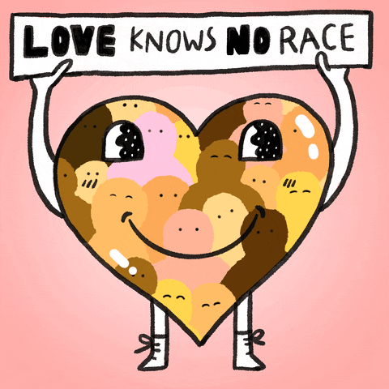
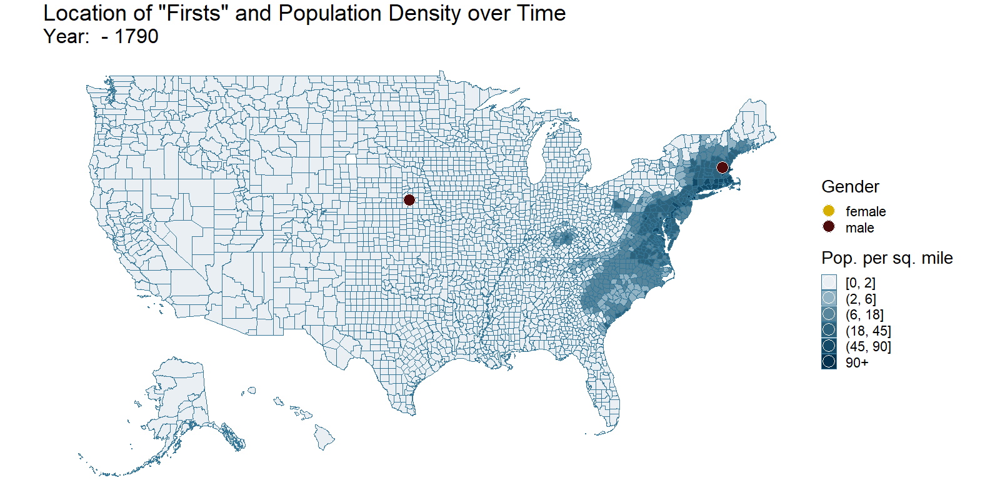
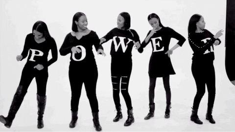

```{r setup, include = FALSE}

knitr::opts_chunk$set(
  echo = TRUE,
  message = FALSE, # no messages
  warning = FALSE, # no warnings
  # tidy=FALSE,    # display code as typed
  size="small")    # slightly smaller font for code

# default visualisation params
knitr::opts_chunk$set(
  # fig.width=6.75, 
  # fig.height=6.75,
  fig.align = "center"
)

```


```{r libraries, include = FALSE}

# load necessary libraries

library(tidyverse)
library(vroom)
library(janitor)
library(sf)
library(here)
library(extrafont)
library(ggtext)
library(lubridate)
library(urbnmapr)
library(readxl)
library(stringr)
library(ggnewscale)
library(gganimate)
library(animation)
library(transformr)
library(tidyquant)
library(rvest)
library(parsedate)
library(opencage)
library(gender)

loadfonts(device="win")

```


[source](https://www.projectlooksharp.org/blog/wp-content/uploads/2020/02/black-lives-matter-1024x575.png)

# Celebrating Black Lives

In years gone by, **Black History Month** has been the only time of year when people talk about the achievements of Black People and recognise their contributions.

We want to change this by analysing **African-American Firsts**, that have historically marked footholds. These breakings of the colour barrier across a wide range of topics have often led to widespread cultural change. 

In the following work, we will

- scrape data from [Wikipedia](https://en.wikipedia.org/wiki/List_of_African-American_firsts), where a list of **African-American Firsts** can be found
- enrich this data by scraping additional information from other [Wikipedia](https://en.wikipedia.org/wiki/Main_Page) sites
- clean the data and add [population information](https://conservancy.umn.edu/handle/11299/181605)
- look at the number of **African-American Firsts** over time and draw connections to American history
- analyse where the achievers were born (geospatial analysis)
- take a critical look at the gender gap 
- see how old the achievers were when breaking the colour barrier

Fasten your seatbelt and let the wild ride begin!

  
[source](https://giphy.com/gifs/originals-dawnie-jefferson-thats-wild-that-is-UufAH7FSltoa7NzIKF)


# The Data

As indicated above, the process of data extraction, enrichment, and cleaning is quite complex and time-consuming.
We will execute the following steps:

- We will first scrape the list of **African-American Firsts**, that can be found on [Wikipedia](https://en.wikipedia.org/wiki/List_of_African-American_firsts).
- After that, we will scrape the individual [Wikipedia](https://en.wikipedia.org/wiki/Main_Page) webpages of each individual achiever to get their birthdays and birth locations. 
- Third, we will use the scraped location information to get geospatial information via forward geocoding.
- Fourth, we infer the gender of each achiever and the category of the achievement. 
- Finally, we clean up loose ends, load shapefiles for America and enrich this geospatial data by adding [population information](https://conservancy.umn.edu/handle/11299/181605).

## Scraping List of African-American Firsts

In this part, we scrape the complete [Wikipedia page](https://en.wikipedia.org/wiki/List_of_African-American_firsts) containing the list of **African-American Firsts**. For this, we leverage the `rvest` library. Even though this part is inspired by [tidytuesday](https://github.com/rfordatascience/tidytuesday/tree/master/data/2020/2020-06-09), we have completely revised the code, such that only little resemblance is left. 


```{r scraping wikipedia list, eval = FALSE}

# define URL of the list of African-American Firsts
first_url <- "https://en.wikipedia.org/wiki/List_of_African-American_firsts"


# load complete wikipedia page into R
raw_first <- read_html(first_url)


# function to extract the year of a "first" from the raw HTML code
get_year <- function(id_num){
  
  # parse raw HTML code to extract the year of the "first"
  raw_first %>% 
    html_nodes(glue::glue("#mw-content-text > div > h4:nth-child({id_num}) > span.mw-headline")) %>% 
    html_attr("id")
  
}


# function to extract the complete line / entry of each "first" from the raw HTML code
get_first <- function(id_num){
  
  # parse raw HTML code to extract the line / entry of the "first"
  raw_first %>% 
    html_nodes(glue::glue("#mw-content-text > div > ul:nth-child({id_num}) > li")) %>% 
    # store multiple "first" per year in a list
    lapply(function(x) x)
}


# find years and complete lines / entries of the "firsts" in the scraped webpage
raw_first_df <- tibble(id_num = 1:409) %>% 
  mutate(
         # year contains the year of the "firsts"
         year = map(id_num, get_year),
         # data contains the raw lines / entries of the "firsts" 
         # we have one list of lines / entries per each year
         data = map(id_num, get_first)) %>% 
  
  # convert year to integer
  mutate(year = as.integer(year)) %>% 
  
  # fill empty year cells with the last existing value for year
  fill(year) %>% 
  
  # give each raw line / entry of a "first" its own row, i.e.
  # unnest the list of entries into separate rows
  unnest(data)


# function to extract the link to the wikipedia page of the person, that has achieved the "first"
extract_website <- function(x) {
  
  # parse raw line / entry of the "first" to extract the wikipedia link
  x %>% 
    str_replace(":.*?<a", ": <a") %>% 
    str_extract(": <a href=\\\".*?\\\"") %>% 
    str_extract("/wiki.*?\\\"") %>% 
    str_replace("\\\"", "")
  
}


# function to extract the concrete description of the "first"
extract_first <- function(x) {
  
  # parse raw line / entry of the "first" to extract the description of the "first"
  x %>% 
    str_extract("^First.*?:") %>% 
    str_replace(":", "")
  
}


# function to extract the name of the person, that has achieved the "first"
extract_name <- function(x) {
  
  # parse raw line / entry of the "first" to extract the name of the achiever
  x %>% 
    str_replace(":.*?<a", ": <a") %>% 
    str_extract(": <a href=\\\".*?\\\">") %>% 
    str_extract("title=.*\\\">") %>% 
    str_replace("title=\\\"", "") %>% 
    str_replace("\\\">", "")
  
}


# extract wikipedia links, names and description of "firsts"
clean_first <- raw_first_df %>%
  mutate(
         # get raw html string (with tags) for the complete lines of the "firsts" 
         data_string_raw = map_chr(data, toString),
         # get only html text (without tags) for the complete lines of the "firsts
         data_string_cle = map_chr(data, html_text)) %>% 
  
  mutate(
         # get the link to the wikipedia page of the person, that has achieved the "first"
         wiki = map_chr(data_string_raw, extract_website),
         # get the concrete description of the "first"
         first = map_chr(data_string_cle, extract_first),
         # get the name of the person, that has achieved the "first"
         name = map_chr(data_string_raw, extract_name)) %>% 
  # drop rows where some information is missing
  drop_na()


# clean up
rm(extract_first, extract_name, extract_website, 
   get_first, get_year, 
   raw_first, raw_first_df, first_url)

```


WOW! That was quite some parsing and wrangling with the HTML. However, this was only the beginning!  
We do not yet have too much information.. We basically only know the year of the achievement, the name of the achiever, what the person did and a link to the wikipedia page of that person. What we would be really interested in is where the achiever was born (in order to perform geospatial analyses) and when the achiever was born (in order to analyse how old the person was when achieving the "first"). 

Well, let's move on and collect this information in the next section!


## Scraping Individual Wikipedia Pages of the Achievers

In this section, we will scrape the individual [Wikipedia](https://en.wikipedia.org/wiki/Main_Page) webpages of each individual achiever. Thanks to our good work in the last section, we know the link to the [Wikipedia](https://en.wikipedia.org/wiki/Main_Page) page of each individual achiever!

We scrape the [Wikipedia](https://en.wikipedia.org/wiki/Main_Page) page of each individual achiever in order to find out their birth date and their location of birth. 


```{r scraping individual pages, eval = FALSE}

# function to get the location and birthday of a person given a 
# link to the wikipedia page of that person
extract_bday_location <- function(wiki){
  
  # read complete wikipedia page of a person
  html <- read_html(paste0("https://en.wikipedia.org", wiki))
  
  
  # extract birth date by parsing the raw HTML
  
  # if we are lucky, wikipedia tells us exactly where
  # to find the birthday
  bd <- html %>% 
    html_node(glue::glue('span[class="bday"]')) %>% 
    html_text()
  
  # if not, we have to do some advanced HTML parsing to 
  # find the birthday
  if(is.na(bd)){
    
    bd <- html %>% 
      html_node("table.vcard") %>% 
      toString() %>% 
      str_replace_all("\\n", "") %>% 
      str_extract("Born.*?</td>") %>% 
      str_extract("<td>.*?<") %>% 
      str_replace("<td>", "") %>% 
      str_replace("<", "") %>% 
      str_replace("\\(.*", "") %>% 
      str_trim() %>% 
      str_replace_all("[^[:alnum:] ]", "") %>% 
      # convert parsed birthday string to a date
      parse_date(approx = TRUE)
    
  }
  
  # finally we convert the bday to a string
  if(!is.na(bd)){
    bd <- toString(bd)
  }

  
  # extract birth location by parsing the raw HTML
  
  # parse raw HTML to find birth location
  lo <- html %>% 
    html_node("table.vcard") %>% 
    toString() %>% 
    str_replace_all("\\n", "") %>% 
    str_extract("Born.*?</td>") %>% 
    str_replace("Born</th>", "")
  
  # handling of edge cases
  if(length(str_locate_all(lo, "<br>")[[1]]) == 4){
    lo <- str_replace(lo, "<br>", "")
  }
  
  lo <- lo %>% str_extract("<br><.*?</td>$")
  
  if(!is.na(lo)){
    lo <- lo %>% 
      read_html() %>% 
      html_text()
  }
  
  
  # return bday and location of birth as a list
  return(list(bd, lo))
  
}


# extract birthday and location and store them in new columns
clean_first_augmented <- suppressMessages(clean_first %>% 
                                         # extract birthday and location from wikipedia
                                         mutate(combi = map(wiki, extract_bday_location)) %>% 
                                         # unnest birthday and location into separate columns
                                         unnest_wider(combi) %>% 
                                         # rename new columns
                                         rename(bday = `...1`, location = `...2`) %>% 
                                         # convert bday to character (from list type)
                                         mutate(bday = map_chr(bday, function(x) x))) %>% 
  
  # it is possible that there was a mistake with the extraction of the birthday 
  # --> delete the wrong birthday in such cases
  mutate(bday = ifelse(year(bday) == 2020, NA_character_, bday))


# clean up
rm(clean_first, extract_bday_location)


```

Nice! We have successfully enriched our dataset with birthdays and locations. However, the locations alone are not really helpful. To do some geospatial analyses, we need the geocodes. Let's move on!

## Forward Geocoding of Locations

To be able to visualise our findings using maps, we need the geolocations. Hence, we use the opencage package to get lng/lat
of the location of birth for each individual achiever:

```{r geocoding, eval = FALSE}

# wrapper function of `opencage_forward` to handle missing locations
opencage_custom <- function(x) {
  
  # if there is no location, return NA
  if(is.na(x)){
    return(NA_character_)
  }
  
  # otherwise find geolocation with opencage
  else{
    return(opencage_forward(x, limit = 1))
  }
  
}


# find geolocation for each individual achiever
clean_first_augmented <- suppressMessages(clean_first_augmented %>% 
                                            
                                         # get information from opencage
                                         mutate(location_geo = map(location, opencage_custom)) %>% 
                                         
                                         # parse and clean the information from opencage
                                         unnest_wider(location_geo) %>% 
                                         unnest(results, keep_empty = TRUE) %>% 
                                         rename(lat = geometry.lat,
                                                lng = geometry.lng,
                                                country = components.country,
                                                state = components.state,
                                                county = components.county,
                                                city = components.city,
                                                FIPS_state = annotations.FIPS.state) %>% 
                                         select(id_num, year, data_string_raw, data_string_cle, 
                                                wiki, first, name, bday, 
                                                location, lat, lng, country, state, county, city, FIPS_state))


# clean up
rm(opencage_custom)

```


That went smoothly! We are now able to use lng/lat to produce beautiful maps! However, we are still not 100% happy with our data.
It would be really great to also have information about the field of the achievement and the gender of the achiever. We will infer both variables in the next section.

## Infer Gender and Category

For our analysis, we want to know which kind of "first" was achieved, i.e. we want to map each "first" into a category.   
Additionally, we want to know which sex the achievers have.

We will start by getting a `category` variable. To map each "first" into a category, we define words that are indicators for specific categories. If we find such a word in the description of a "first", we categorize this "first" accordingly:

```{r find category, eval = FALSE}

# define indicator words for each category

edu <- c(
  "practice", "graduate", "learning", "college", "university", "medicine",
  "earn", "ph.d.", "professor", "teacher", "school", "nobel", "invent", "patent",
  "medicine", "degree", "doctor", "medical", "nurse", "physician", "m.d.", "b.a.", "b.s.", 
  "m.b.a", "principal", "space", "astronaut", "scientific") %>% 
  paste0(collapse = "|")

religion <- c("bishop", "rabbi", "minister", "church", "priest", "pastor", "missionary",
              "denomination", "jesus", "jesuits", "diocese", "buddhis", "cardinal") %>%
  paste0(collapse = "|")

politics <- c(
  "diplomat", "elected", "nominee", "supreme court", "legislature", "mayor", "governor",
  "vice President", "president", "representatives", "political", "department", "peace prize",
  "ambassador", "government", "white house", "postal", "federal", "union", "trade",
  "delegate", "alder", "solicitor", "senator", "intelligience", "combat", "commissioner",
  "state", "first lady", "cabinet", "advisor", "guard", "coast", "secretary", "senate",
  "house", "agency", "staff", "national committee", "lie in honor") %>%
  paste0(collapse = "|")

sports <- c(
  "baseball", "football", "basketball", "hockey", "golf", "tennis",
  "championship", "boxing", "games", "medal", "game", "sport", "olympic", "nascar",
  "coach", "trophy", "nba", "nhl", "nfl", "mlb", "stanley cup", "jockey", "pga",
  "race", "driver", "ufc", "champion", "highest finishing position") %>%
  paste0(collapse = "|")

military <- c(
  "serve", "military", "enlist", "officer", "army", "marine", "naval",
  "officer", "captain", "command", "admiral", "prison", "navy", "general",
  "force") %>%
  paste0(collapse = "|")

law <- c("american bar", "lawyer", "police", "judge", "attorney", "law", 
         "agent", "fbi") %>%
  paste0(collapse = "|")

arts <- c(
  "opera", "sing", "perform", "music", "billboard", "oscar", "television",
  "movie", "network", "tony award", "paint", "author", "book", "academy award", "curator",
  "director", "publish", "novel", "grammy", "emmy", "smithsonian",
  "conduct", "picture", "pulitzer", "channel", "villain", "cartoon", "tv", "golden globe",
  "comic", "magazine", "superhero", "pulitzer", "dancer", "opry", "rock and roll", "radio",
  "record") %>%
  paste0(collapse = "|")

social <- c("community", "freemasons", "vote", "voting", "rights", "signature", 
            "royal", "ceo", "community", "movement", "invited", "greek", "million",
            "billion", "attendant", "chess", "pilot", "playboy", "own", "daughter",
            "coin", "dollar", "stamp", "niagara", "pharmacist",
            "stock", "north pole", "reporter", "sail around the world", 
            "sail solo around the world", "press", "miss ",
            "everest")  %>%
  paste0(collapse = "|")


# categorize "firsts" by looking for indicator words in the description
first_df <- clean_first_augmented %>% 
  mutate(category = case_when(
    str_detect(tolower(first), military) ~ "Military",
    str_detect(tolower(first), law) ~ "Law",
    str_detect(tolower(first), arts) ~ "Arts & Entertainment",
    str_detect(tolower(first), social) ~ "Social & Jobs",
    str_detect(tolower(first), religion) ~ "Religion",
    str_detect(tolower(first), edu) ~ "Education & Science",
    str_detect(tolower(first), politics) ~ "Politics",
    str_detect(tolower(first), sports) ~ "Sports",
    TRUE ~ NA_character_
  )) %>% 
  rename(accomplishment = first)


# clean up
rm(arts, edu, law, first_url, military, politics, religion, social, sports,
   clean_first_augmented)

```


Next, we try to infer the sex of a person, that has achieved a "first". To do this, we both look at the description of the first and look for indicators like "she", "women" or "man" and use the `gender` package to infer sex:

```{r infer gender, eval = FALSE}

# add gender

# see if we find words in the description of the "first", that identify gender
first_df <- first_df %>% 
  mutate(gender = if_else(str_detect(data_string_cle, 
                                     "\\swoman\\s|\\sWoman\\s|\\sher\\s|\\sshe\\s|\\sfemale\\s"), 
                          "female", 
                  if_else(str_detect(data_string_cle, 
                                     "\\sman\\s|\\sMan\\s|\\shim\\s|\\she\\s|\\smale\\s"), 
                          "male", 
                          "idk")))


# use gender package as second source of info (parse first name)
# input: full name and the year of the "first"
get_gender <- function(name, year){
  
  # get first name
  name <- strsplit(name, split = " ")[[1]][1]
  
  # define right method (see ?gender)
  method = ifelse(year < 1930, "ipums", "ssa")
  
  # get the gender
  ret <- gender(name, method = method, countries = "United States") %>% 
    select(gender) %>% 
    pull()
  
  if(typeof(ret) == "logical"){
    return(NA_character_)
  }
  else{
    return(ret)
  }
  
}


# build final "gender" column
first_df <- first_df %>% 
  # use first name and year to infer gender
  mutate(gender_2 = map2(name, year, get_gender)) %>% 
  # convert to character
  mutate(gender_2 = map_chr(gender_2, function(x) x)) %>%
  # combine both gender columns into one final column
  mutate(gender = if_else(gender != "idk", gender, gender_2)) %>% 
  select(-gender_2)


# clean up
rm(get_gender)

```


Great! We can finally say:

  
[source](https://giphy.com/gifs/l4RKhOL0xiBdbgglFi)

Let us save this part of our work as a csv:

```{r save data, eval = FALSE}

write_csv(first_df, path = here("../data/firsts_augmented.csv"))

```


In the next section, we can now calculate variables like `age` and load shapefiles for the mapping.

## Data Transformation and Shapefile Loading

### Load and Transform "Firsts"

Let us load our scraped and curated data and have a look at it:

```{r load glimpse}

# load "firsts" data and clean column names
firsts <- read_csv(here("../data/firsts_augmented.csv"), 
                   col_types = cols(year = col_integer(), 
                                    id_num = col_integer())) %>% 
  clean_names()

# glimpse at data
glimpse(firsts)

```

As we took care of cleaning the data while scraping, there is no much work left to do. We can see that we have quite some NAs. This is because we were not always able to scrape a `bday` or geocode a `location`. However, this shouldn't be a big issue for our analysis and unfortunately there is nothing we can do about it. 

We do not need the columns `id_num`, `data_string_raw`, `data_string_cle`, and `wiki` anymore. Hence, we can drop them:

```{r drop columns}

firsts <- firsts %>% 
  select(-data_string_raw, 
         -data_string_cle,
         -wiki, 
         -id_num)

```


For our analysis, we need a binned `year` variable and a variable `age`, that measures how old a person was when achieving the "first". We create them in the following:

```{r transform firsts}

# cut year into buckets 
# needed for gganimate and the timeline
firsts <- firsts %>% 
  
  # binwidth = 10 years
  mutate(year_bins = cut(year, 
                        breaks = c(min(year)-1, c(seq(1790, 2020, 10))), 
                        labels = c(seq(1790, 2020, 10)))) %>% 
  mutate(year_bins = as.integer(levels(year_bins))[year_bins]) %>% 
  
  # binwidth = 5 years
  mutate(year_bins_2 = cut(year, 
                        breaks = c(min(year)-1, c(seq(1760, 2020, 5))), 
                        labels = c(seq(1760, 2020, 5)))) %>% 
  mutate(year_bins_2 = as.integer(levels(year_bins_2))[year_bins_2])


# calculate age when person achieved the "first"
# also cut age into buckets
firsts <- firsts %>% 
  mutate(age = year - year(bday)) %>% 
  
  # binwidth = 10 years
  mutate(age_bins = cut(age, 
                        breaks = c(seq(0, 100, 10)), 
                        labels = c(seq(0, 90, 10)),
                        right  = FALSE)) %>% 
  mutate(age_bins = as.integer(levels(age_bins))[age_bins])


```

Additionally, we will analyse the gender gap and stereotypical gender roles regarding African-American Achievements.
For this purpose, we transform the `firsts` dataframe into two dedicated dataframes:

```{r gender data trafo}

# calculate number of "firsts" by gender over the years
sex_count <- firsts %>%
  
  # filter out NAs
  filter(!is.na(gender),
         !is.na(year_bins)) %>%
  
  # count "firsts" by gender and binned years
  group_by(year_bins, gender) %>% 
  count() %>% 
  
  # order by year
  arrange(year_bins)


# unfortunately, there was no data for the 1820 year bin
# to have a truthful line chart, we have to add it manually
sex_count_1820 <- sex_count %>% 
  
  # take year 1800 as blueprint
  filter(year_bins == 1800) %>%
  
  # change year to 1820 and numbers to 0
  mutate(year_bins = as.integer(1820),
         n = as.integer(0))


# add the 1820 year bin to the data
sex_count <- bind_rows(sex_count, sex_count_1820)


# bring numbers by gender and year into wide format
# i.e. have "male" column and a "female" column per year bin
sex_count_wider <- sex_count %>% 
  
  # make gender columns wider
  pivot_wider(names_from = gender, values_from = n) %>% 
  
  # add missing values as 0
  mutate(female = if_else(is.na(female), as.integer(0), female))


# also have the data in long format (with missing values added as 0)
sex_count <- sex_count_wider %>% 
  pivot_longer(female:male, names_to = "gender", values_to = "n")


# add helper variable to create a ribbon in a chart
sex_count_wider <- sex_count_wider %>% 
  mutate(middle = ifelse(female > male,male,female))


# clean up
rm(sex_count_1820)


################################################################################


# calculate number of "firsts" by gender and category
gender_category_df<- firsts %>% 
  
  # filter out NAs
  filter(!is.na(gender),
         !is.na(category)) %>% 
  
  # rename categories with long names
  mutate(category = if_else(category == "Education & Science", "Edu & Science", 
                    if_else(category == "Arts & Entertainment", "Arts & Entertainment", 
                            category))) %>% 
  
  # count number of firsts by gender
  group_by(gender) %>% 
  mutate(number_firsts = n()) %>% 
  
  # regroup by gender and category
  ungroup() %>% 
  group_by(gender, category) %>% 
  
  mutate(
         # count number of first by gender and category
         number_category_firsts = n(),
         # calculate proportion of "firsts" for a category within gender
         pct_category_firsts = number_category_firsts / number_firsts) %>% 
  
  # only select relevant columns and rows
  select(gender, category, pct_category_firsts) %>% 
  distinct() %>% 
  
  # order descending by pct_category_firsts
  # and make category a factor in that order
  arrange(desc(pct_category_firsts)) %>% 
  mutate(category = fct_inorder(category))

```


Great, that should be it! We conclude this section by describing our `firsts` tibble:

#### Data Dictionary

|variable |class     |description |
|:--------|:---------|:-----------|
|year     |integer   | Year of the achievement |
|accomplishment     |character | Description of the actual achievement or attainment |
|name   |character | The person who accomplished the specific accomplishment |
|category   |character | A few meta-categories of different accomplishments |
|bday |date | Birthday of the achiever |
|gender |character | Gender of the achiever |
|location |character | Location of birth of the achiever |
|lat |double | Location of birth of the achiever: Longitude |
|lng |double | Location of birth of the achiever: Latitude |
|country |character | Location of birth of the achiever: Country |
|state |character | Location of birth of the achiever: State |
|county |character | Location of birth of the achiever: County |
|city |character | Location of birth of the achiever: City |
|fips_state |character | Location of birth of the achiever: FIPS of State |
|year_bins |integer | Binned year of the achievement, binwidth = 10 years |
|year_bins_2 |integer | Binned year of the achievement, binwidth = 5 years |
|age |double | Age of person when the "first" was achieved |
|age_bins |integer | Binned age |


### Load and Transform Shapefiles

To be able to plot our data on a map, we need the shapefiles of the US and we have to convert the firsts to a compatible format. For this, we leverage the `sf` package and the `urbnmapr` package:

```{r shapefiles}

# load counties shapefile
counties_sf <- get_urbn_map("counties", sf = TRUE)

# transfrom geometry to 4326, or pairs of latitude/longitude numbers
counties_sf <-  counties_sf %>% 
  
  # transfrom to WGS84, latitude/longitude
  st_transform(4326) 


# convert firsts to a sf object with jitter on coordinates
set.seed(100)
firsts_jitter_sf <- firsts %>% 
  
  # drop rows with missing values
  drop_na(lng, lat, gender) %>%
  
  # jitter points such that they are better visible
  mutate(lng = jitter(lng, amount = 1),
         lat = jitter(lat, amount = 1)) %>% 
  
  # filter for valid locations in the US
  filter(country == "United States of America") %>% 
  filter(lng > -140) %>% 
  
  # convert to sf object
  st_as_sf(coords = c('lng', 'lat'), 
           crs = st_crs(counties_sf))


```

Note that we have jittered the coordinates of the birth locations, as there are for example a lot of locations pointing to New York City. Using jitter makes the maps we will produce much more insightful, as points are not overlapping that much anymore.  

What is also important for our analysis are actual population numbers. Because at first sight, the geospatial distribution of firsts might seem odd. However, taking actual population data into account might give a much clearer picture. Hence, we load [population data](https://conservancy.umn.edu/handle/11299/181605) from 1790-2010:


```{r population}

# load absolute population data from 1790-2010 and clean names
# source: https://conservancy.umn.edu/handle/11299/181605
population_abs <- read_xlsx(here("../data/county2010_hist_pops.xlsx"), sheet = "c2010_hist_pops") %>% 
  clean_names()

# bring data into long format and clean the year
population_abs <- population_abs %>% 
  
  # bring to long format
  pivot_longer(cols = epop1790:pop2010, names_to = "year", values_to = "pop") %>% 
  
  # extract / clean year
  mutate(year = str_sub(year, -4, -1)) %>% 
  
  # only take relevant columns
  select(geoid10, year, pop)


# load population density data from 1790-2010 and clean names
# source: https://conservancy.umn.edu/handle/11299/181605
population_dens <- read_xlsx(here("../data/county2010_hist_pops.xlsx"), sheet = "densities") %>% 
  clean_names()

# bring data into long format and clean the year
population_dens <- population_dens %>% 
  
  # bring to long format
  pivot_longer(cols = dens1790:dens2010, names_to = "year", values_to = "dens") %>% 
  
  # extract / clean year
  mutate(year = str_sub(year, -4, -1))


# join population densities and absolute numbers in one table
population <- population_dens %>% 
  left_join(population_abs) %>% 
  
  # cut density into buckets (otherwise we have some with values of over 2000, 
  # and others with values < 2 --> not good for visualisation / colouring)
  mutate(dens_2 = cut(dens, 
                      breaks = c(-0.1, 2, 6, 18, 45, 90, max(dens)),
                      labels = c("[0, 2]", 
                                 "(2, 6]", 
                                 "(6, 18]", 
                                 "(18, 45]", 
                                 "(45, 90]", 
                                 "90+"),
                      ordered_result = TRUE)) %>% 
  
  # convert year to integer
  mutate(year = as.integer(year))


# we only have population data until 2010. However, we also have "firsts" in the period of 2010-2020.
# to be able to animate this properly with gganimate, we will duplicate the 2010 values and set them
# as values for 2020. We will end up with population data for 1790 until 2020.
# To say it clear: we assume that there are no changes in population from 2010 to 2020.

pop_2020 <- population %>% 
  filter(year == 2010) %>% 
  mutate(year = 2020)

population <- bind_rows(population, pop_2020) %>% 
  arrange(geoid10, year)


# join counties_sf and population data
counties_pop_sf <- counties_sf %>% 
  left_join(population, by = c("county_fips" = "geoid10"))


# clean up
rm(population, population_abs, population_dens, pop_2020)

```


We end up having a ready-to-plot shapefile of "firsts" and a shapefile to plot US counties.
Additionally, we have a big shapefile `counties_pop_sf`, that holds information about the population in each US county
since 1790!

Unbelievable, this was the last part of the data scraping and wrangling part! We are ready to go on now to visualise the data and tell our story!

Let's say goodbye to this technically demanding part of our work:

  
[source](https://giphy.com/gifs/venommovie-sony-venom-movie-Dr1i3afFIL68D9adzp)


# The Story

Let us now analyse our nicely scraped and transformed data to celebrate **African-American Achievements**!  
In the following, we will

- look at the number of **African-American Firsts** over time and draw connections to American history
- analyse where the achievers were born (geospatial analysis)
- take a critical look at the gender gap and stereotypical gender roles
- see how old the achievers were when breaking the colour barrier
- investigate which states have given rise to most achievers

Let us dive in!


## "Firsts" over Time and a Stroll through American History

First, let us have a look at the number of **African-American Achievements** over time:

```{r history}

firsts %>% 
  # count number of "firsts" in each bin
  count(year_bins_2) %>% 
  
  # initiate ggplot
  ggplot(aes(x = year_bins_2, y = n)) +
  # plot "firsts" over time as blue line
  geom_line(size = 1, color = "#04314D") + 
  
  # customize theme
  theme_minimal() + 
  theme(axis.title.x = element_blank(),
        axis.title.y = element_blank(),
        panel.grid.major.x = element_blank(),
        panel.grid.minor = element_blank(),
        plot.title.position = "plot") +
  theme(text = element_text(family = "Lato", 
                            colour = "black"),
        plot.title = element_text(family = "Lato", 
                                  colour = "black"),
        plot.subtitle = element_text(family = "Lato", 
                                     colour = "black")) +
  
  # add labels
  labs(title = "A Stroll through American History",
       subtitle = "Number of \"Firsts\" over Time") +
  
  NULL

```

We can clearly identify that there is a positive trend! However, there are a lot of ups and downs. What causes these spikes in the number of "Firsts"? We did extensive research, that we present in the following paragraphs. Sources include [history.com](https://www.history.com/topics/black-history/black-history-milestones) and [archives.gov](https://www.archives.gov/research/african-americans). 

### Civil War

Moving along the timeline, the first spike we see occurs around the 1860s. Any of us that take interest in the US history would know that these are the years of the Civil War, taking place from 1861 to 1865. This period has a central focus in the long standing controversy of black people's enslavement and naturally stands out as a moment of deep change for the African American community in the US.

```{r hist civil war}

firsts %>% 
  # count number of "firsts" in each bin
  count(year_bins_2) %>% 
  
  # initiate ggplot
  ggplot(aes(x = year_bins_2, y = n)) +
  # plot "firsts" over time as blue line
  geom_line(size = 1, color = "#04314D") + 
  
  # customize theme
  theme_minimal() + 
  theme(axis.title.x = element_blank(),
        axis.title.y = element_blank(),
        panel.grid.major.x = element_blank(),
        panel.grid.minor = element_blank(),
        plot.title.position = "plot") +
  theme(text = element_text(family = "Lato", 
                            colour = "black"),
        plot.title = element_text(family = "Lato", 
                                  colour = "black"),
        plot.subtitle = element_text(family = "Lato", 
                                     colour = "black")) +
  
  # add vertical golden line for Civil War
  annotate("segment", 
           x = 1861 , 
           y = -Inf, 
           xend = 1861, 
           yend = 18, 
           color = "#D6AF00", 
           size = 1) +
  # add text for Civil War
  geom_text(data = data.frame(x = 1845, y = 16.5, label = "Civil War"),
            aes(x = x, y = y, label = label),
            colour = "black",
            family = "Lato",
            inherit.aes = FALSE,
  ) +
  
  # add labels
  labs(title = "A Stroll through American History",
       subtitle = "Number of \"Firsts\" over Time") +
  
  NULL

```

In more detail, even if central in the dispute between secessionists and unionists, the banning of slavery was not the initial reason of the dispute. The southern states saw fit to split from the Union and saw slavery as a focal point of divergence. At the very beginning of the war, Lincoln's Union Army COULDN'T recruit black men because of a previous law. Out of necessity and with great uncertainty about the reactions of more racist states, the Union leader later passed a preliminary emancipation proclamation stating that "slaves within any State, or designated part of a State… in rebellion, …shall be then, thenceforward, and forever free".

This was a very strategic move as it brought roughly 179,000 black men to serve as soldiers in the Army and fight for the Union. Moreover, it deprived the Confederacy of a great bulk of its labour force, unsettling the socio-economic dynamics of the secessionists.

As slavery was considered illegal after the end of the Civil War, African Americans enjoyed a period when they were allowed to vote, actively participate in the political process, acquire the land of former owners, seek their own employment, and use public accommodations. With this, a great deal of firsts arose and are clearly shown in our graph.

### The Aftermath and WWII

The second large increase is close to the beginning of the second half of the 20th century. It takes very little historical knowledge to link this date to the Second World War, but let's see in more detail how did this horrible period shape positively the African American Opportunities in society.

```{r hist wwII}

firsts %>% 
  # count number of "firsts" in each bin
  count(year_bins_2) %>%
  
  # initiate ggplot
  ggplot(aes(x = year_bins_2, y = n)) +
  # plot "firsts" over time as blue line
  geom_line(size = 1, color = "#04314D") + 
  
  # customize theme
  theme_minimal() + 
  theme(axis.title.x = element_blank(),
        axis.title.y = element_blank(),
        panel.grid.major.x = element_blank(),
        panel.grid.minor = element_blank(),
        plot.title.position = "plot") +
  theme(text = element_text(family = "Lato", 
                            colour = "black"),
        plot.title = element_text(family = "Lato", 
                                  colour = "black"),
        plot.subtitle = element_text(family = "Lato", 
                                     colour = "black")) +
  
  # add vertical golden line for Civil War
  annotate("segment", 
           x = 1861 , 
           y = -Inf, 
           xend = 1861, 
           yend = 18, 
           color = "#D6AF00", 
           size = 1, 
           alpha = 0.2) +
  # add text for Civil War
  geom_text(data = data.frame(x = 1845, y = 16.5, label = "Civil War"),
            aes(x = x, y = y, label = label),
            colour = "black",
            family = "Lato",
            inherit.aes = FALSE,
            alpha = 0.2
  ) +
  
  # add vertical golden line for WWII
  annotate("segment", 
           x = 1941 , 
           y = -Inf, 
           xend = 1941, 
           yend = 28, 
           color = "#D6AF00", 
           size = 1) +
  # add text for WWII
  geom_text(data = data.frame(x = 1920, y = 26.5, label = "World War II"),
            aes(x = x, y = y, label = label),
            colour = "black",
            family = "Lato",
            inherit.aes = FALSE
  ) +
  
  # add labels
  labs(title = "A Stroll through American History",
       subtitle = "Number of \"Firsts\" over Time") +
  
  NULL

```

On broad terms, we could say that the need for men in the military drove integration. In 1941 fewer than 4,000 African Americans were serving in the military and, by contrast, in 1945 1,2 million individuals of colour were wearing the military uniform. EVen if they were fighting in a segregates style, the sense of unity and camaraderie sparked a process of inclusion that later developed in the society after WWII.

Looking at the firsts during the War, we could list (1939-45):

- The first Graduate of the U.S. Naval Academy
- First African-American flag officer
- First African-American to be awarded the Navy Cross
- First African-American member of the U.S. Marine Corps
- First African-American U.S. Marine Corps officer

These are all very intertwined with the inclusion of African Americans in the military environment. Nevertheless, the forced connection from fighting in the same ranks and the marketing campaigns from the government to motivate people of colour to join the army were normalizing the inclusion of black people back in the US.

On that note, the following list addresses non military firsts that occurred during the war in non military related fields:

- First African American to star in her own television program
- First African American to be portrayed on a U.S. postage stamp
- First African American to win an Oscar
- First African-American artists to have a #1 hit on the Billboard charts
- First African-American woman to earn a Ph.D. in mathematics

To finalize this chapter of African American History, it is important to mention the Second Great Migration. This was a demographic shift of a great number of black individuals towards the nothern states. People of colour were convinced to move/change life due to the financially appealing offers from defense related factories in the North that were experiencing shortages. As a great amount of African Americans moved to more liberal states they enjoyed more freedom (exemplified by the right to vote), and hence initiated a healing/improvement process that would see the Black community empowered by opportunity.

It is for the events above and for the outcome of WWII that "The Pittsburgh courier" stated this war period as a "Double Victory", over the Nazis in Europe and over racists at home.

### I have a Dream Speech / Civil Rights Movement

Even if significant in the breakthrough of African Americans in Society, the above events couldn't be enough to find equality between people of colour and white Americans. Specifically, after the 1860s very few relevant laws were passed with the intention of protecting black people's rights. It is for this reason that, between 1955 and 1968, non violent large mass protests took place with the intention of disrupting the normal functioning of urban centers and forcing a positive dialogue.


```{r hist luther king}

firsts %>% 
  # count number of "firsts" in each bin
  count(year_bins_2) %>%
  
  # initiate ggplot
  ggplot(aes(x = year_bins_2, y = n)) +
  # plot "firsts" over time as blue line
  geom_line(size = 1, color = "#04314D") + 
  
  # customize theme
  theme_minimal() + 
  theme(axis.title.x = element_blank(),
        axis.title.y = element_blank(),
        panel.grid.major.x = element_blank(),
        panel.grid.minor = element_blank(),
        plot.title.position = "plot") +
  theme(text = element_text(family = "Lato", 
                            colour = "black"),
        plot.title = element_text(family = "Lato", 
                                  colour = "black"),
        plot.subtitle = element_text(family = "Lato", 
                                     colour = "black")) +
  
  # add vertical golden line for Civil War
  annotate("segment", 
           x = 1861 , 
           y = -Inf, 
           xend = 1861, 
           yend = 18, 
           color = "#D6AF00", 
           size = 1, 
           alpha = 0.2) +
  # add text for Civil War
  geom_text(data = data.frame(x = 1845, y = 16.5, label = "Civil War"),
            aes(x = x, y = y, label = label),
            colour = "black",
            family = "Lato",
            inherit.aes = FALSE,
            alpha = 0.2
  ) +
  
  # add vertical golden line for WWII
  annotate("segment", 
           x = 1941, 
           y = -Inf, 
           xend = 1941, 
           yend = 28, 
           color = "#D6AF00", 
           size = 1, 
           alpha = 0.2) +
  # add text for WWII
  geom_text(data = data.frame(x = 1920, y = 26.5, label = "World War II"),
            aes(x = x, y = y, label = label),
            colour = "black",
            family = "Lato",
            inherit.aes = FALSE,
            alpha = 0.2
  ) +
  
  # add line for I Have a Dream
  annotate("segment", 
           x = 1963 , 
           y = -Inf, 
           xend = 1963, 
           yend = 38, 
           color = "#D6AF00", 
           size = 1) +
  # add text for I Have a Dream
  geom_text(data = data.frame(x = 1905, y = 36.5, label = "March on Washington: I Have a Dream"),
            aes(x = x, y = y, label = label),
            colour = "black",
            family = "Lato",
            inherit.aes = FALSE
  ) +
  
  # add labels
  labs(title = "A Stroll through American History",
       subtitle = "Number of \"Firsts\" over Time") +
  
  NULL

```

It is needless to say that these protests received some part of resistance from conservative racists, especially in the southern part of the country. Without going in too much detail about this extremely eventful period in American History, the decade could be described as something that sets a before and an after. Specifically, people of colour were fighting for the end of segregation in education, healthcare, public transportation, legal representation and, more broadly speaking, political representation. They found the latter in Malcom X and Martin Luther King, being the loud voices that couldn't be ignored.

Pairing this to the liberal views in Washington, represented by John F Kennedy, the outcome was painful but surely positive. As a result of this rough period, the Historic Civil RIghts Act was passed in 1964, officially outlawing discrimination based on sex, race, color, national origin or gender identity. With this breakthrough legislation, all future firsts have been greatly facilitated, as we can see from the spike in the late 1900s.

### Barack Obama Becomes 44th U.S. President

The most recent landmark event we want to highlight is the election of Barack Obama as the first African-American President of the United States of America.

```{r hist obama}

firsts %>% 
  # count number of "firsts" in each bin
  count(year_bins_2) %>%
  
  # initiate ggplot
  ggplot(aes(x = year_bins_2, y = n)) +
  # plot "firsts" over time as blue line
  geom_line(size = 1, color = "#04314D") + 
  
  # customize theme
  theme_minimal() + 
  theme(axis.title.x = element_blank(),
        axis.title.y = element_blank(),
        panel.grid.major.x = element_blank(),
        panel.grid.minor = element_blank(),
        plot.title.position = "plot") +
  theme(text = element_text(family = "Lato", 
                            colour = "black"),
        plot.title = element_text(family = "Lato", 
                                  colour = "black"),
        plot.subtitle = element_text(family = "Lato", 
                                     colour = "black")) +
  
  # add vertical golden line for Civil War
  annotate("segment", 
           x = 1861 , 
           y = -Inf, 
           xend = 1861, 
           yend = 18, 
           color = "#D6AF00", 
           size = 1, 
           alpha = 0.2) +
  # add text for Civil War
  geom_text(data = data.frame(x = 1845, y = 16.5, label = "Civil War"),
            aes(x = x, y = y, label = label),
            colour = "black",
            family = "Lato",
            inherit.aes = FALSE,
            alpha = 0.2
  ) +
  
  # add vertical golden line for WWII
  annotate("segment", 
           x = 1941, 
           y = -Inf, 
           xend = 1941, 
           yend = 28, 
           color = "#D6AF00", 
           size = 1, 
           alpha = 0.2) +
  # add text for WWII
  geom_text(data = data.frame(x = 1920, y = 26.5, label = "World War II"),
            aes(x = x, y = y, label = label),
            colour = "black",
            family = "Lato",
            inherit.aes = FALSE,
            alpha = 0.2
  ) +
  
  # add line for I Have a Dream
  annotate("segment", 
           x = 1963 , 
           y = -Inf, 
           xend = 1963, 
           yend = 38, 
           color = "#D6AF00", 
           size = 1, 
           alpha = 0.2) +
  # add text for I Have a Dream
  geom_text(data = data.frame(x = 1905, y = 36.5, label = "March on Washington: I Have a Dream"),
            aes(x = x, y = y, label = label),
            colour = "black",
            family = "Lato",
            inherit.aes = FALSE,
            alpha = 0.2
  ) +
  
  # add line for Barack Obama
  annotate("segment", 
           x = 2008 , 
           y = -Inf, 
           xend = 2008, 
           yend = 48, 
           color = "#D6AF00", 
           size = 1) +
  # add text for Barack Obama
  geom_text(data = data.frame(x = 1952, y = 46.5, label = "First Black President: Barack Obama"),
            aes(x = x, y = y, label = label),
            colour = "black",
            family = "Lato",
            inherit.aes = FALSE
  ) +
  
  # add labels
  labs(title = "A Stroll through American History",
       subtitle = "Number of \"Firsts\" over Time") +
  
  NULL

```

Obama’s appearances in both the primaries and the general election drew impressive crowds, and his message of hope and change embodied by the slogan “Yes We Can” inspired thousands of new voters, many young and Black, to cast their vote for the first time in the historic election. He was reelected in 2012.

### Further Remarks

What changes will future bring? With racist tendencies rising again all over the world in recent years, we pray for a future with **one** society and **equality for everyone**!

Using local polynomial regression fitting (LOESS = locally estimated scatterplot smoothing), we find an interesting pattern in our data:

```{r hist model}

firsts %>% 
  # count number of "firsts" in each bin
  count(year_bins_2) %>%
  
  # initiate ggplot
  ggplot(aes(x = year_bins_2, y = n)) +
  # plot "firsts" over time as blue line
  geom_line(size = 1, color = "#04314D") + 
  
  # add LOESS model line
  geom_smooth(method = "loess", 
              se = FALSE,
              color = "#D6AF00") + 
  
  # customize theme
  theme_minimal() + 
  theme(axis.title.x = element_blank(),
        axis.title.y = element_blank(),
        panel.grid.major.x = element_blank(),
        panel.grid.minor = element_blank(),
        plot.title.position = "plot") +
  theme(text = element_text(family = "Lato", 
                            colour = "black"),
        plot.title = element_text(family = "Lato", 
                                  colour = "black"),
        plot.subtitle = element_text(family = "Lato", 
                                     colour = "black")) +
  
  # add labels
  labs(title = "When will be the next Boost in \"Firsts\"?",
       subtitle = "Number of \"Firsts\" over Time") +
  
  # add arrow to left plateau
  geom_curve(data = data.frame(x = 1843, y = 33, xend = 1882, yend = 8.4),
             mapping = aes(x = x, y = y, xend = xend, yend = yend),
             colour = "black",
             curvature = 0,
             arrow = arrow(length = unit(2, "mm"), type = "closed"),
             inherit.aes = FALSE) +
  
  # add arrow to right plateau
  geom_curve(data = data.frame(x = 1845, y = 34, xend = 1995, yend = 26),
             mapping = aes(x = x, y = y, xend = xend, yend = yend),
             colour = "black",
             curvature = 0,
             arrow = arrow(length = unit(2, "mm"), type = "closed"),
             inherit.aes = FALSE) +
  
  # add text
  geom_text(data = data.frame(x = 1821.5, y = 34.7, label = "Two Plateaus"),
            aes(x = x, y = y, label = label),
            colour = "black",
            family = "Lato",
            inherit.aes = FALSE
  ) +
  
  NULL

```

We can see that there is a boost in "Firsts" basically all 100 years! As we have analysed, especially the Civil War as well as WWII and the Civil Rights Movement have pushed numbers. Hopefully, the next boost is not 100 years away and is not facilitated by a war!

  
[source](https://giphy.com/gifs/IntoAction-VzeF077i8nOgnRS917)

## Geographical Distribution of "Firsts"

We are not only interested in the mere number of "Firsts" over time, but we also want to know where our African-American achievers came from!

As it is only natural that states with a higher population density give rise to more achievers, we plot the locations of
African-American Achievers over time, together with the population density over time:


```{r maps 1}

# change names for gganimate to work
firsts_jitter_sf_animate <- firsts_jitter_sf %>% 
  rename(year = year_bins, year_full = year)

# visualise population density and locations of "firsts" over time
p <- ggplot() +
  
  # draw polygons from counties shapefile,
  # fill with population density
  geom_sf(data = counties_pop_sf, aes(fill = dens_2), 
          color = "#367696") +
  # define colours for population density fill
  scale_fill_manual(breaks = levels(counties_pop_sf$dens_2),
                    values = c("#e9eff2", 
                               "#93b4c4", 
                               "#57859c", 
                               "#2d627d", 
                               "#114966", 
                               "#04314D"),
                    name = "Pop. per sq. mile") +
  
  # enable a new "fill" dimension for gender
  new_scale_fill() + 
  
  # add locations from firsts shapefile
  geom_sf(
    data = firsts_jitter_sf_animate, 
    aes(fill = gender), 
    size = 9, 
    shape = 21,
    show.legend = TRUE,
    color = "white"
  ) + 
  # fill by gender
  scale_fill_manual(values = c("#D6AF00", "#4D0B0C")) +
  
  # add labels
  labs(subtitle = "Year: {previous_frame} - {current_frame}",
       title = "Location of \"Firsts\" and Population Density over Time",
       fill  = "Gender") + 
  
  # customize theme
  theme_minimal()+
  coord_sf(datum = NA) + # remove coordinates
  theme(axis.text = element_blank(),
        text = element_text(size = 28, 
                            family = "Lato", 
                            colour = "black"),
        plot.subtitle = element_text(size = 32, 
                            family = "Lato Black", 
                            colour = "black"),
        plot.title = element_text(size = 36, 
                            family = "Lato", 
                            colour = "black")) +
  
  # animate the "firsts" and pop density over the years
  transition_manual(year) + 
  
  NULL


# render gif and save it
# animate(p, fps = 2, height = 800, width = 1600)
# anim_save("../misc/firsts_over_time.gif", animation = last_animation())


```


  

This is quite impressive! We can clearly see the forward wave of American expansion to the West, that ended with the admission of the last few territories as states in 1912. As the great majority of the U.S. population lives in the east, it is only natural that most achievers come from there. Only from the middle of the 20th century onward we also have achievers coming from the big cities at the West coast. 

Let us have a deeper look at those periods in time, that we have analysed above:

```{r maps 2, cache = TRUE}

## Filter for data before Civil War:
firsts_jitter_sf_filtered <- firsts_jitter_sf %>% 
  filter(year <= 1860)

# compute relevant average population density
counties_pop_sf_filtered <- counties_pop_sf %>% 
  filter(year <= 1860) %>% 
  
  # calculate average population density
  group_by(county_fips) %>% 
  summarise(dens_agg = mean(dens), geometry = first(geometry)) %>% 
  
  # cut into bins as in the data transformation part
  mutate(dens_2 = cut(dens_agg, 
                      breaks = c(-0.1, 2, 6, 18, 45, 90, max(dens_agg)),
                      labels = c("[0, 2]", 
                                 "(2, 6]", 
                                 "(6, 18]", 
                                 "(18, 45]", 
                                 "(45, 90]", 
                                 "90+"),
                      ordered_result = TRUE))


ggplot() +
  # draw polygons from counties shapefile
  # fill with population density
  geom_sf(data = counties_pop_sf_filtered, aes(fill = dens_2), 
          color = "#367696") +
  # define colours for population density fill
  scale_fill_manual(values = c("#e9eff2", "#93b4c4", "#57859c", "#2d627d", "#114966", "#04314D"),
                    name = "Pop. per sq. mile") +
  
  # enable a new "fill" dimension for gender
  new_scale_fill() + 
  
  # add locations from firsts shapefile
  geom_sf(
    data = firsts_jitter_sf_filtered, 
    aes(fill = gender), 
    size = 3, 
    shape = 21,
    show.legend = TRUE, 
    color = "white"
  ) + 
  # fill by gender
  scale_fill_manual(values = c("#D6AF00", "#4D0B0C")) +
  
  # add labels
  labs(subtitle = "before 1861",
       title = "Location of \"Firsts\" and Population Density",
       fill  = "Gender") +
  
  # customize theme
  theme_minimal()+
  coord_sf(datum = NA) + # remove coordinates
  theme(axis.text = element_blank(),
        text = element_text(family = "Lato", 
                            colour = "black"),
        plot.title = element_text(family = "Lato", 
                                  colour = "black"),
        plot.subtitle = element_text(family = "Lato", 
                                     colour = "black")) +
  
  NULL

```
It is not surprising that there are very few "Firsts" before the Civil War. Achievements were particularly focused on the east coast, with people coming especially from the big cities of that time: New York, Washington DC, Boston or Atlanta.

Looking at this map and the next one, we can also see how fast Americans settled in all parts of the country!

```{r maps 3, cache = TRUE}


## Filter for data 1861-1940:
firsts_jitter_sf_filtered <- firsts_jitter_sf %>% 
  filter(year >= 1861, year < 1941)

# compute relevant average population density
counties_pop_sf_filtered <- counties_pop_sf %>% 
  filter(year <= 1940, year >= 1860) %>% 
  
  # calculate average population density
  group_by(county_fips) %>% 
  summarise(dens_agg = mean(dens), geometry = first(geometry)) %>% 
  
  # cut into bins as in the data transformation part
  mutate(dens_2 = cut(dens_agg, 
                      breaks = c(-0.1, 2, 6, 18, 45, 90, max(dens_agg)),
                      labels = c("[0, 2]", 
                                 "(2, 6]", 
                                 "(6, 18]", 
                                 "(18, 45]", 
                                 "(45, 90]", 
                                 "90+"),
                      ordered_result = TRUE))


ggplot() +
  # draw polygons from counties shapefile
  # fill with population density
  geom_sf(data = counties_pop_sf_filtered, aes(fill = dens_2), 
          color = "#367696") +
  # define colours for population density fill
  scale_fill_manual(values = c("#e9eff2", "#93b4c4", "#57859c", "#2d627d", "#114966", "#04314D"),
                    name = "Pop. per sq. mile") +
  
  # enable a new "fill" dimension for gender
  new_scale_fill() + 
  
  # add locations from firsts shapefile
  geom_sf(
    data = firsts_jitter_sf_filtered, 
    aes(fill = gender), 
    size = 3, 
    shape = 21,
    show.legend = TRUE, 
    color = "white"
  ) + 
  # fill by gender
  scale_fill_manual(values = c("#D6AF00", "#4D0B0C")) +
  
  # add labels
  labs(subtitle = "1861 - 1940",
       title = "Location of \"Firsts\" and Population Density",
       fill  = "Gender") +
  
  # customize theme
  theme_minimal()+
  coord_sf(datum = NA) + # remove coordinates
  theme(axis.text = element_blank(),
        text = element_text(family = "Lato", 
                            colour = "black"),
        plot.title = element_text(family = "Lato", 
                                  colour = "black"),
        plot.subtitle = element_text(family = "Lato", 
                                     colour = "black")) +
  
  NULL

```

Between the Civil War and World War II, again most achievers came from the leading cultural and political regions of the US.
By that time, no African-American Achiever has been born in the West of the US!

```{r maps 4, cache = TRUE}

## Filter for data 1941-1962:
firsts_jitter_sf_filtered <- firsts_jitter_sf %>% 
  filter(year >= 1941, year < 1963)

# compute relevant average population density
counties_pop_sf_filtered <- counties_pop_sf %>% 
  filter(year <= 1960, year >= 1940) %>% 
  
  # calculate average population density
  group_by(county_fips) %>% 
  summarise(dens_agg = mean(dens), geometry = first(geometry)) %>% 
  
  # cut into bins as in the data transformation part
  mutate(dens_2 = cut(dens_agg, 
                      breaks = c(-0.1, 2, 6, 18, 45, 90, max(dens_agg)),
                      labels = c("[0, 2]", 
                                 "(2, 6]", 
                                 "(6, 18]", 
                                 "(18, 45]", 
                                 "(45, 90]", 
                                 "90+"),
                      ordered_result = TRUE))


ggplot() +
  # draw polygons from counties shapefile
  # fill with population density
  geom_sf(data = counties_pop_sf_filtered, aes(fill = dens_2), 
          color = "#367696") +
  # define colours for population density fill
  scale_fill_manual(values = c("#e9eff2", "#93b4c4", "#57859c", "#2d627d", "#114966", "#04314D"),
                    name = "Pop. per sq. mile") +
  
  # enable a new "fill" dimension for gender
  new_scale_fill() + 
  
  # add locations from firsts shapefile
  geom_sf(
    data = firsts_jitter_sf_filtered, 
    aes(fill = gender), 
    size = 3, 
    shape = 21,
    show.legend = TRUE, 
    color = "white"
  ) + 
  # fill by gender
  scale_fill_manual(values = c("#D6AF00", "#4D0B0C")) +
  
  # add labels
  labs(subtitle = "1941 - 1962",
       title = "Location of \"Firsts\" and Population Density",
       fill  = "Gender") +
  
  # customize theme
  theme_minimal()+
  coord_sf(datum = NA) + # remove coordinates
  theme(axis.text = element_blank(),
        text = element_text(family = "Lato", 
                            colour = "black"),
        plot.title = element_text(family = "Lato", 
                                  colour = "black"),
        plot.subtitle = element_text(family = "Lato", 
                                     colour = "black")) +
  
  NULL

```

In the aftermath of WWII and the rise of the Civil Rights Movement, the "Firsts" are more spread over the whole country. Centers like San Francisco or Los Angeles are catching up.


```{r maps 5, cache = TRUE}

## Filter for data 1963-2007:
firsts_jitter_sf_filtered <- firsts_jitter_sf %>% 
  filter(year >= 1963, year < 2008)

# compute relevant average population density
counties_pop_sf_filtered <- counties_pop_sf %>% 
  filter(year <= 2010, year >= 1960) %>% 
  
  # calculate average population density
  group_by(county_fips) %>% 
  summarise(dens_agg = mean(dens), geometry = first(geometry)) %>% 
  
  # cut into bins as in the data transformation part
  mutate(dens_2 = cut(dens_agg, 
                      breaks = c(-0.1, 2, 6, 18, 45, 90, max(dens_agg)),
                      labels = c("[0, 2]", 
                                 "(2, 6]", 
                                 "(6, 18]", 
                                 "(18, 45]", 
                                 "(45, 90]", 
                                 "90+"),
                      ordered_result = TRUE))


ggplot() +
  # draw polygons from counties shapefile
  # fill with population density
  geom_sf(data = counties_pop_sf_filtered, aes(fill = dens_2), 
          color = "#367696") +
  # define colours for population density fill
  scale_fill_manual(values = c("#e9eff2", "#93b4c4", "#57859c", "#2d627d", "#114966", "#04314D"),
                    name = "Pop. per sq. mile") +
  
  # enable a new "fill" dimension for gender
  new_scale_fill() + 
  
  # add locations from firsts shapefile
  geom_sf(
    data = firsts_jitter_sf_filtered, 
    aes(fill = gender), 
    size = 3, 
    shape = 21,
    show.legend = TRUE, 
    color = "white"
  ) + 
  # fill by gender
  scale_fill_manual(values = c("#D6AF00", "#4D0B0C")) +
  
  # add labels
  labs(subtitle = "1963 - 2007",
       title = "Location of \"Firsts\" and Population Density",
       fill  = "Gender") +
  
  # customize theme
  theme_minimal()+
  coord_sf(datum = NA) + # remove coordinates
  theme(axis.text = element_blank(),
        text = element_text(family = "Lato", 
                            colour = "black"),
        plot.title = element_text(family = "Lato", 
                                  colour = "black"),
        plot.subtitle = element_text(family = "Lato", 
                                     colour = "black")) +
  
  NULL

```

Between 1963 and 2007 it is clearly visible that change especially happens in the world-open metropolises of the US, namely Los Angeles, Washington DC, New York and Boston.


```{r maps 6, cache = TRUE}

## Filter for data after 2008:
firsts_jitter_sf_filtered <- firsts_jitter_sf %>% 
  filter(year >= 2008)

# compute relevant average population density
counties_pop_sf_filtered <- counties_pop_sf %>% 
  filter(year <= 2020, year >= 2000) %>% 
  
  # calculate average population density
  group_by(county_fips) %>% 
  summarise(dens_agg = mean(dens), geometry = first(geometry)) %>% 
  
  # cut into bins as in the data transformation part
  mutate(dens_2 = cut(dens_agg, 
                      breaks = c(-0.1, 2, 6, 18, 45, 90, max(dens_agg)),
                      labels = c("[0, 2]", 
                                 "(2, 6]", 
                                 "(6, 18]", 
                                 "(18, 45]", 
                                 "(45, 90]", 
                                 "90+"),
                      ordered_result = TRUE))


ggplot() +
  # draw polygons from counties shapefile
  # fill with population density
  geom_sf(data = counties_pop_sf_filtered, aes(fill = dens_2), 
          color = "#367696") +
  # define colours for population density fill
  scale_fill_manual(values = c("#e9eff2", "#93b4c4", "#57859c", "#2d627d", "#114966", "#04314D"),
                    name = "Pop. per sq. mile") +
  
  # enable a new "fill" dimension for gender
  new_scale_fill() + 
  
  # add locations from firsts shapefile
  geom_sf(
    data = firsts_jitter_sf_filtered, 
    aes(fill = gender), 
    size = 3, 
    shape = 21,
    show.legend = TRUE, 
    color = "white"
  ) + 
  # fill by gender
  scale_fill_manual(values = c("#D6AF00", "#4D0B0C")) +
  
  # add labels
  labs(subtitle = "from 2008",
       title = "Location of \"Firsts\" and Population Density",
       fill  = "Gender") +
  
  # customize theme
  theme_minimal()+
  coord_sf(datum = NA) + # remove coordinates
  theme(axis.text = element_blank(),
        text = element_text(family = "Lato", 
                            colour = "black"),
        plot.title = element_text(family = "Lato", 
                                  colour = "black"),
        plot.subtitle = element_text(family = "Lato", 
                                     colour = "black")) +
  
  NULL

```

We hope for the change and love to spread further and also to rise from more rural regions in the (mid-) West!

## Gender Gap over Time

This dataset is not only a source to study racial discrimination, but also to have a look at gender inequality. 
Let us again visualise the number of "Firsts" over time, but now grouped by gender: 

```{r gender gap}

# use sex_count_wider dataframe created in the transformation part
# for the ribbons
sex_count_wider %>% 
  ggplot(aes(x = year_bins)) +
  
  # use sex_count dataframe created in the transformation part
  # for the lines by gender
  geom_line(data = sex_count, 
            aes(x = year_bins, 
                y = n, 
                color = gender),
            size = 1) +
  
  # colour by gender
  scale_color_manual(values = c("#D6AF00", "#4D0B0C"), 
                     name = "Gender") +
  
  # add gray ribbon to visualise gender gap
  geom_ribbon(aes(ymin = middle, ymax = male, group = 1), 
              fill = "grey50", 
              alpha = 0.2) +
  
  # add labels
  labs(title = "Gender Gap persists over Time",
       subtitle = "Number of \"Firsts\" by Gender",
       x = "Year",
       y = "Number of Firsts") +
  
  # customize theme
  theme_minimal() + 
  theme(axis.title.x = element_blank(),
        axis.title.y = element_blank(),
        panel.grid.major.x = element_blank(),
        panel.grid.minor = element_blank(),
        plot.title.position = "plot",
        text = element_text(family = "Lato", 
                            colour = "black"),
        plot.title = element_text(family = "Lato", 
                                  colour = "black"),
        plot.subtitle = element_text(family = "Lato", 
                                     colour = "black")) +
  
  NULL

```

Even though African-Americans have growing achievements over the years, there is a clear gender gap visible in the number of "Firsts". One might even say that the gender gap has broadened! In the two spikes of the 1860s and the 1960s, male numbers
grew much more than female numbers. Additionally, the difference between sexes stayed the same in following years, which is clearly demonstrated by the gray shades in the graph.  
However, entering the 21st century, gender equality seems to have improved a lot!

  
[source](https://giphy.com/gifs/thesocialphotog-black-women-girls-rock-dancing-ZCez8nLG5Kpg0AVMsm)


## Analysing Gender and Category

However, gender (in-)equality is not only about the mere number of "Firsts", but also about stereotypical gender roles.
Let us analyse, how numbers of "Firsts" are distributed across different categories by gender:

```{r gender cat, fig.width = 12}

# use gender_category_df dataframe created above
gender_category_df %>%
  
  # plot barchart with categories ordered by their percentage
  ggplot(aes(y = pct_category_firsts, 
             x = reorder(category, desc(pct_category_firsts)),
             fill = gender)) +
  
  # side-by-side barchart
  geom_col(width = 0.7, 
           position='dodge') +
  
  # fill by gender
  scale_fill_manual(values = c("#D6AF00", "#4D0B0C"),
                    name = "Gender") +
  
  # add single digit percentage labels for males in the graph
  geom_text(
    aes(label = ifelse(gender == "male" & pct_category_firsts < 0.1, 
                       paste0(round(pct_category_firsts * 100, 0), "%"), 
                       "")), 
    color = "white", 
    size = 4.5,
    vjust = 1.5,
    hjust = -0.45
  ) +
  
  # add double digit percentage labels for males in the graph
  geom_text(
    aes(label = ifelse(gender == "male" & pct_category_firsts >= 0.1, 
                       paste0(round(pct_category_firsts * 100, 0), "%"), 
                       "")), 
    color = "white", 
    size = 4.5,
    vjust = 1.5,
    hjust = -0.15
  ) +
  
  # add single digit percentage labels for females in the graph
  geom_text(
    aes(label = ifelse(gender == "female" & pct_category_firsts < 0.1, 
                       paste0(round(pct_category_firsts * 100, 0), "%"), 
                       "")), 
    color = "white", 
    size = 4.5,
    vjust = 1.5,
    hjust = 1.35
  ) +
  
  # add double digit percentage labels for females in the graph
  geom_text(
    aes(label = ifelse(gender == "female" & pct_category_firsts >= 0.1, 
                       paste0(round(pct_category_firsts * 100, 0), "%"),
                       "")), 
    color = "white", 
    size = 4.5,
    vjust = 1.5,
    hjust = 1.12
  ) +
  
  # add labels
  labs(title = "African-American Achievements follow stereotypical Gender Roles!",
       subtitle = "Proportion of \"Firsts\" per Category by Gender")+
  
  # customize theme
  theme_minimal() +
  theme(axis.title.y = element_blank(),
        axis.title.x = element_blank(),
        panel.grid = element_blank(),
        axis.text.y = element_blank(),
        text = element_text(family = "Lato", 
                            colour = "black",
                            size   = 13),
        plot.title = element_text(family = "Lato", 
                                  colour = "black",
                                  size = 18),
        plot.subtitle = element_text(family = "Lato", 
                                     colour = "black",
                                     size = 15)) +
  
  NULL

```

Looking at the Firsts over Categories for African American Men and Women, we see that there are certain trends: Women's firsts are most prevalent in the Arts and Entertainment sectors, however they are also present in the Education and Sciences. For Men, the Sciences and Military Sector are pretty strong, as well as Politics. 
This confirms the alleged gender bias and overrepresentation of males in technical and political spheres whereas women are traditionally pushed into the Arts and Social sectors.

There is a lot of work to do to reach gender and racial equality! 

## Age Distribution by Category

Let us now come to a more light hearted topic and analyse how old the persons were, when they achieved their firsts. 
For this, we create bar charts showing the age distribution for different categories:

```{r}

firsts %>%
  
  # filter NA values
  filter(!is.na(age_bins)) %>% 
  
  # group by age and category
  group_by(age_bins, category) %>% 
  
  # count number of individuals for each age interval and category
  count() %>% 
  
  # create bar chart showing age distribution for different categories
  ggplot(aes(x = age_bins, y = n)) +
  geom_col(fill = "#04314D") +
  
  # label graph
  labs(title = "Different \"Firsts\" are typically achieved with different ages!",
       subtitle = "Number of \"Firsts\" by Age and Category",
       x = "Age",
       y = "Number of \"Firsts\"") +
  
  # create multi-panel plots by category
  # enable free y scale to focus on distributions rather than actual numbers
  facet_wrap(~category,
             scales = "free_y") +
  
  # customize theme
  theme_minimal() + 
  theme(axis.title.y = element_blank(),
        panel.grid.major.x = element_blank(),
        panel.grid.minor = element_blank(),
        plot.title.position = "plot",
        text = element_text(family = "Lato", 
                            colour = "black"),
        plot.title = element_text(family = "Lato", 
                                  colour = "black"),
        plot.subtitle = element_text(family = "Lato", 
                                     colour = "black")) +
  
  NULL


```
From this multi-panel bar chart, we can see that different categories have different age distributions. The achievers in categories like Arts & Entertainment, Sports, Education & Science, and Social & Jobs are relatively young, whereas those firsts in categories like Politics and the Military are relatively older. We are unable to make conclusions on the age trends of categories in the religion and law as we do not have too many data points for these respective categories. We can see that the age trends between the Sports and Politics category are very different so let's dive deeper into these 2 categories:

```{r two_category}

# pipe data
firsts %>%
  
  # filter NA values
  filter(!is.na(age_bins)) %>% 
  
  # group by age and category
  group_by(age_bins, category) %>% 
  
  # filter for 2 categories that show contrasting findings in age intervals
  filter(category == "Sports" | category == "Politics")  %>%
  
  # order Sports before Politics
  mutate(category = factor(category, levels = c("Sports", "Politics"))) %>% 
  
  # count number of individuals for each age interval and category
  count() %>% 
  
  # create bar chart showing age distribution for two categories
  ggplot(aes(x = age_bins, y = n)) +
  geom_col(fill = "#04314D") +
  
  # label graph
  labs(title = "\"Firsts\" in Sports are generally achieved in a younger age than \"Firsts\" in Politics",
       subtitle = "Number of \"Firsts\" by Age and Category",
       x = "Age",
       y = "Number of \"Firsts\"") +
  
  # create multi-panel plots by category
  # enable free y scale to focus on distributions rather than actual numbers
  facet_wrap(~category,
             scales = "free_y") +
  
  # customize theme
  theme_minimal() + 
  theme(axis.title.y = element_blank(),
        panel.grid.major.x = element_blank(),
        panel.grid.minor = element_blank(),
        plot.title.position = "plot",
        text = element_text(family = "Lato", 
                            colour = "black"),
        plot.title = element_text(family = "Lato", 
                                  colour = "black"),
        plot.subtitle = element_text(family = "Lato", 
                                     colour = "black")) +
  
  NULL
  
```

From the zoomed-in comparison of the two categories, we can see that the age distribution between the sports and politics category is very different. This may be because individuals who work in the political sector are generally older than those who are active in sports. In addition, the politics sector has also been slightly more hierarchical compared to the sports sector. These two explanations ensure that the findings from the plot are reasonable. 

## Firsts per State

Finally, let us come back to some geographical analysis. Even though we have already mapped the birth locations of our **African-Amerian Achievers**, we now want to analyse the number of "Firsts" by state:

```{r}

firsts %>% 
  
  # remove NAs
  filter(!is.na(state)) %>%
  
  # count number of "firsts" per state
  count(state) %>% 
  
  # calculate relative number of "firsts" per state
  mutate(tot = sum(n), 
         pct = round(n / sum(n) * 100, 1),
         NY  = ifelse(state == "New York", TRUE, FALSE)) %>%
  
  # only visualise states that gave rise to more than 3% of "firsts"
  filter(pct > 3) %>% 
  
  # initialise ggplot
  ggplot(aes(x =  pct,
             # order states by their percentage of "firsts"
             y = reorder(state, pct), 
             fill = NY)) +  
  
  # create bar chart
  geom_col() + 
  
  # fill New York blue, all other states gray
  scale_fill_manual(values = c("grey80", "#04314D")) + 
  
  # ensure that there is no space between the state labels and the plot
  scale_x_continuous(expand = expansion(mult = c(0, 0))) +
  
  # add the percentages on the bars
  geom_text(
    aes(label = paste0(pct, "%")),
    colour = "white",
    size = 4,
    hjust = 1.2,
    family = "Lato")+
  
  # adding the comment on new york part 1
  geom_text(
    data = data.frame(x = 7, y = 3.5, label = "New York outnumbers"),
    aes(x = x, y = y, label = label),
    colour = "black",
    family = "Lato",
    size = 4,
    hjust = 1,
    lineheight = .6,
    inherit.aes = FALSE)+
  
  # adding the comment on new york part 2
  geom_text(
    data = data.frame(x = 6.65, y = 2.7, label = "all other states"),
    aes(x = x, y = y, label = label),
    colour = "black",
    family = "Lato",
    size = 4,
    hjust = 1,
    lineheight = .6,
    inherit.aes = FALSE)+
  
  # adding the arrow pointing to the New York Column
  geom_curve(
    data = data.frame(x = 6, y = 4, xend = 7.5, yend = 13),
    mapping = aes(x = x, y = y, xend = xend, yend = yend),
    colour = "black",
    size = 0.5,
    curvature = 0.18,
    arrow = arrow(length = unit(2, "mm"), type = "closed"),
    inherit.aes = FALSE) +
  
  # adding titles and subtitles
  labs(title = "The most liberal States take the highest number of \"Firsts\"",
       subtitle = "Percentage of \"Firsts\" per State",
       caption = "") +
  
  # customize theme
  theme_minimal() + 
  theme(axis.title.y = element_blank(),
        axis.title.x = element_blank(),
        axis.text.x = element_blank(),
        panel.grid.major = element_blank(),
        panel.grid.minor = element_blank(),
        plot.title.position = "plot",
        legend.position = "none",
        text = element_text(family = "Lato", 
                            colour = "black"),
        plot.title = element_text(family = "Lato", 
                                  colour = "black"),
        plot.subtitle = element_text(family = "Lato", 
                                     colour = "black"),
        ) +
  
  NULL

```

The growth in population in America was strongly focused on the East Coast until around the 1920s, much earlier than for parts in central and western America. This can be explained by migration of communities over time. Hence, it can be seen from the bar chart above that the number of firsts have been significantly higher in Eastern States! 

The data collected starts in the middle of the 18th century, during which the percentage of "free" blacks was not uniform, the north-eastern region had a much higher percentage of free blacks throughout the 1800s which may have also contributed to the stark difference between the west and east during that time. The abolition of slavery in the 1860s additionally saw a huge impact in the growth of the firsts in African American communities. 

New York has the highest count in firsts. New York State was one of the pioneer states to abolish slavery in 1827 (It was officially abolished in 1863 in the US), and New York City had one of the largest concentration of free African Americans, with many institutions being established to support the community. 

## Concluding Remarks

We have celebrated Black Lives, their achievements, and many of their battles against racism. Even though these past achievements are outstanding, we must not stop fighting for equality!

Unfortunately, we are not yet in a perfect world, where each and everyone has the same chances and rights. **We must never forget that.** 

Additionally, we have touched upon gender inequality and stereotypical gender roles. Here again we have some way to go!

We hope that our work contributes to raising awareness about the crucial topic of racial and gender inequality.

  
[source](https://giphy.com/gifs/lgbtq-power-of-our-pride-equality-town-hall-Vhu98PhgRWhpjmmzBH)

# Limitations

We must not fail to mention the limitations of our work.

First, we fully relied on the list of "Firsts" provided by [Wikipedia](https://en.wikipedia.org/wiki/List_of_African-American_firsts). 
We have no insights into how accurate or complete this list is.  

Second, some of the "Firsts" are not attributable to a single person. Naturally, such achievements could not find their way into our analyses around gender and age. However, as we also based our geospatial analyses on individual persons by scraping their location of birth, such cases could also not find their way into our maps. 

Next, web scraping is always prone to errors. Even though we did our best to address edge cases, we cannot rule out that there are some errors in the data.  
Adding to this point, we inferred gender by using descriptions and the `gender` library. Again, we cannot rule out errors here. We want to stress that any problems with the data are only due to technical difficulties. In no way do we want to offend any person or family with erroneous data. Please reach out to us if you find any irregularities. 

Finally, we put in a lot of effort to research (African-)American History. Sources include [history.com](https://www.history.com/topics/black-history/black-history-milestones) and [archives.gov](https://www.archives.gov/research/african-americans). However, it might be the case that we missed to present or mention subtle nuances of historic events. We encourage all readers to investigate African-American History themselves and we apologize for any inconsistencies. We are fully aware of the potential brisance of this topic. 

